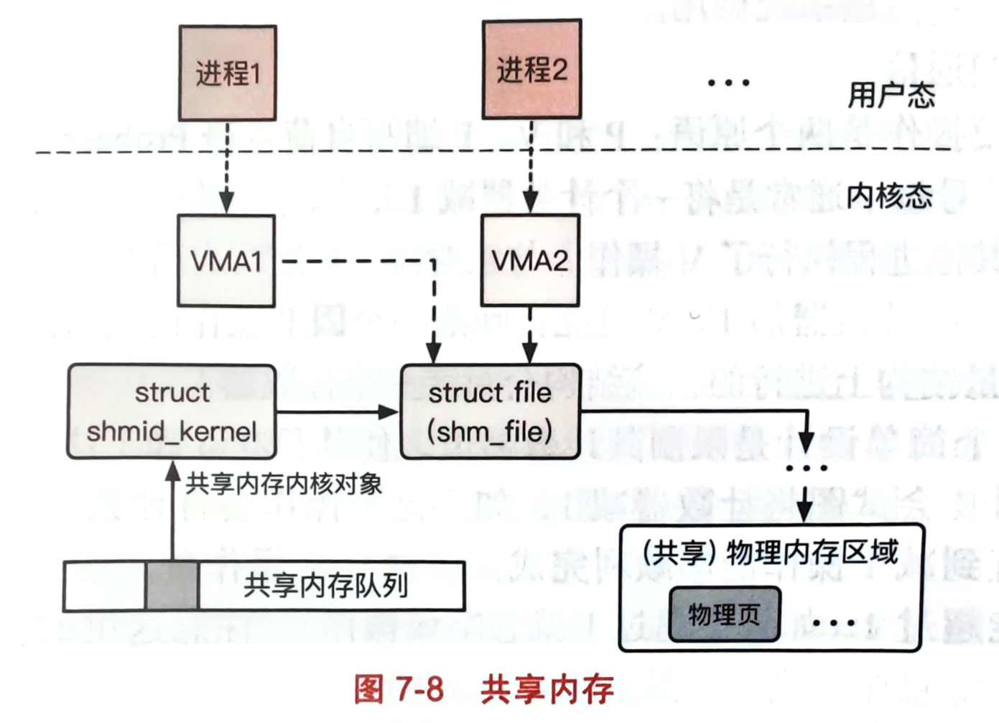

<h1 align="center">操作系统</h1>

# Contents
- [Contents](#contents)
- [计算机系统基础](#计算机系统基础)
  - [讲一讲什么是操作系统？](#讲一讲什么是操作系统)
  - [讲一讲冯诺依曼结构？](#讲一讲冯诺依曼结构)
  - [讲一讲外部中断与异常？](#讲一讲外部中断与异常)
  - [CPU 地址翻译是怎样实现的？](#cpu-地址翻译是怎样实现的)
    - [地址翻译过程](#地址翻译过程)
    - [页表查找与地址翻译](#页表查找与地址翻译)
    - [页表缓存(TLB)](#页表缓存tlb)
  - [介绍一下现代 CPU 指令周期与指令类型？](#介绍一下现代-cpu-指令周期与指令类型)
    - [指令周期](#指令周期)
    - [指令类型](#指令类型)
  - [讲一讲 TLB？](#讲一讲-tlb)
    - [特点](#特点)
    - [工作流程](#工作流程)
  - [什么是局部性原理？](#什么是局部性原理)
    - [时间局部性](#时间局部性)
    - [空间局部性](#空间局部性)
  - [讲一讲用户态与内核态，他们之间怎么切换的？](#讲一讲用户态与内核态他们之间怎么切换的)
    - [用户态与内核态的区别](#用户态与内核态的区别)
    - [触发用户态和内核态之间的切换的场景](#触发用户态和内核态之间的切换的场景)
    - [切换过程](#切换过程)
  - [讲一讲 CPU 缓存？](#讲一讲-cpu-缓存)
    - [类型](#类型)
    - [组织方式](#组织方式)
    - [缓存替换策略](#缓存替换策略)
  - [CPU L1，L2，L3 多级缓存的基本作用？](#cpu-l1l2l3-多级缓存的基本作用)
  - [讲一讲 CPU 的缓存一致性？](#讲一讲-cpu-的缓存一致性)
  - [讲一讲缓存一致性中的 MESI 协议？](#讲一讲缓存一致性中的-mesi-协议)
  - [讲一讲伪共享问题？](#讲一讲伪共享问题)
    - [概念](#概念)
    - [导致的问题](#导致的问题)
    - [解决办法](#解决办法)
  - [程序执行的基本过程？](#程序执行的基本过程)
  - [常用的 Linux 命令？](#常用的-linux-命令)
  - [Linux 页大小是多少？](#linux-页大小是多少)
  - [Linux 下如何查看 CPU 荷载，正在运行的线程，某个端口对应的进程？](#linux-下如何查看-cpu-荷载正在运行的线程某个端口对应的进程)
  - [Linux 下如何排查 CPU 以及内存占用过多？](#linux-下如何排查-cpu-以及内存占用过多)
  - [Linux 如何查看实时的滚动日志？](#linux-如何查看实时的滚动日志)
  - [traceroute 命令的原理？](#traceroute-命令的原理)
    - [基本工作原理](#基本工作原理)
  - [ASCII，Unicode，UTF-8 的区别？](#asciiunicodeutf-8-的区别)
- [并发](#并发)
  - [并发与并行的区别？](#并发与并行的区别)
    - [并发](#并发-1)
    - [并行](#并行)
    - [区别](#区别)
  - [什么是互斥锁，自旋锁呢，底层是怎么实现的？](#什么是互斥锁自旋锁呢底层是怎么实现的)
    - [互斥锁](#互斥锁)
    - [自旋锁](#自旋锁)
    - [区别](#区别-1)
  - [讲一讲死锁，死锁怎么处理？](#讲一讲死锁死锁怎么处理)
    - [死锁条件](#死锁条件)
    - [处理死锁](#处理死锁)
  - [什么是读写锁？](#什么是读写锁)
    - [读写锁的特性](#读写锁的特性)
  - [Linux 同步机制？](#linux-同步机制)
  - [信号量是如何实现的？](#信号量是如何实现的)
    - [基本实现原理](#基本实现原理)
  - [条件变量是如何实现的？](#条件变量是如何实现的)
  - [生产者消费者问题？](#生产者消费者问题)
  - [哲学家进餐问题？](#哲学家进餐问题)
- [内存管理](#内存管理)
  - [内存虚拟化是什么，这么做有什么目的？](#内存虚拟化是什么这么做有什么目的)
  - [逻辑地址(虚拟地址)与物理地址的区别？](#逻辑地址虚拟地址与物理地址的区别)
  - [操作系统在对内存管理时做了什么？](#操作系统在对内存管理时做了什么)
  - [讲一讲物理内存与虚拟内存的映射机制？](#讲一讲物理内存与虚拟内存的映射机制)
  - [什么是换页机制？](#什么是换页机制)
  - [操作系统中的缺页中断？](#操作系统中的缺页中断)
    - [概念](#概念-1)
    - [过程](#过程)
    - [优化策略](#优化策略)
  - [换页时的抖动是什么？](#换页时的抖动是什么)
    - [概念](#概念-2)
    - [原因](#原因)
    - [解决方案](#解决方案)
  - [进程的内存分布？](#进程的内存分布)
  - [堆上建立对象快，还是栈上建立对象快？](#堆上建立对象快还是栈上建立对象快)
  - [常见的内存分配方式？](#常见的内存分配方式)
  - [页置换算法有哪些？](#页置换算法有哪些)
  - [如果 64 位电脑是 4G 内存，要申请 80G 的空间，可以申请嘛？32 位呢？](#如果-64-位电脑是-4g-内存要申请-80g-的空间可以申请嘛32-位呢)
  - [讲一讲 malloc 是怎么实现的？](#讲一讲-malloc-是怎么实现的)
  - [讲一讲 mmap 是怎么实现的？](#讲一讲-mmap-是怎么实现的)
  - [共享内存是如何实现的？](#共享内存是如何实现的)
- [进程与线程管理](#进程与线程管理)
  - [进程、线程、协程区别与联系？](#进程线程协程区别与联系)
    - [区别](#区别-2)
    - [联系](#联系)
  - [讲一讲用户线程与内核线程？](#讲一讲用户线程与内核线程)
    - [用户线程](#用户线程)
    - [内核线程](#内核线程)
    - [总结](#总结)
  - [一个进程可以创建多少个线程？](#一个进程可以创建多少个线程)
  - [进程的调度算法？](#进程的调度算法)
    - [时间片轮转(RR)](#时间片轮转rr)
    - [优先级调度](#优先级调度)
    - [先到先得(FCFS)](#先到先得fcfs)
    - [最短任务优先(SJF)](#最短任务优先sjf)
    - [最短完成时间优先(STCF)](#最短完成时间优先stcf)
    - [多级队列(MLQ)](#多级队列mlq)
    - [多级反馈队列(MLFQ)](#多级反馈队列mlfq)
    - [完全公平调度(CFS)](#完全公平调度cfs)
  - [进程间通信方式？](#进程间通信方式)
    - [管道](#管道)
    - [消息队列](#消息队列)
    - [共享内存](#共享内存)
    - [信号量](#信号量)
  - [讲一讲进程虚拟化？](#讲一讲进程虚拟化)
  - [进程的状态有哪些？](#进程的状态有哪些)
  - [进程如何创建的？](#进程如何创建的)
  - [如何回收线程？](#如何回收线程)
    - [使用 join() 方法](#使用-join-方法)
    - [使用线程分离(detach)](#使用线程分离detach)
    - [使用线程局部存储(Thread-Local Storage, TLS)](#使用线程局部存储thread-local-storage-tls)
  - [进程终止方式？](#进程终止方式)
  - [如何让进程后台运行？](#如何让进程后台运行)
  - [讲一讲守护进程，僵尸进程，孤儿进程？](#讲一讲守护进程僵尸进程孤儿进程)
    - [守护进程](#守护进程)
    - [僵尸进程](#僵尸进程)
    - [孤儿进程](#孤儿进程)
    - [总结](#总结-1)
  - [讲一讲父进程，子进程，进程组，会话？](#讲一讲父进程子进程进程组会话)
    - [父进程(Parent Process)和子进程(Child Process)](#父进程parent-process和子进程child-process)
    - [进程组(Process Group)](#进程组process-group)
    - [会话(Session)](#会话session)
    - [总结](#总结-2)
  - [多进程与多线程怎么选择？](#多进程与多线程怎么选择)
    - [应用场景](#应用场景)
    - [资源需求](#资源需求)
    - [开发和维护难度](#开发和维护难度)
    - [可扩展性](#可扩展性)
    - [容错性和隔离](#容错性和隔离)
  - [什么情况下，进程会进行切换？](#什么情况下进程会进行切换)
  - [进程通信中的管道实现原理是什么？](#进程通信中的管道实现原理是什么)
  - [为什么进程切换慢，线程切换快？](#为什么进程切换慢线程切换快)
- [文件系统](#文件系统)
  - [文件系统虚拟化？](#文件系统虚拟化)
  - [什么是硬链接与符号连接？](#什么是硬链接与符号连接)
    - [硬链接](#硬链接)
      - [硬链接的特点](#硬链接的特点)
    - [符号链接](#符号链接)
      - [符号链接的特点](#符号链接的特点)
  - [讲一讲 Inode 文件系统结构？](#讲一讲-inode-文件系统结构)
  - [讲一讲 FAT 文件系统与 Unix 文件系统？](#讲一讲-fat-文件系统与-unix-文件系统)
    - [FAT 文件系统](#fat-文件系统)
      - [FAT 文件系统的特点](#fat-文件系统的特点)
      - [FAT 文件系统适用场景](#fat-文件系统适用场景)
    - [Unix 文件系统](#unix-文件系统)
      - [Unix 文件系统的特点](#unix-文件系统的特点)
      - [Unix 文件系统适用场景：](#unix-文件系统适用场景)
  - [文件传输中断后如何续传](#文件传输中断后如何续传)
- [服务器编程](#服务器编程)
  - [select poll epoll 的区别与联系？](#select-poll-epoll-的区别与联系)
    - [select](#select)
      - [select 的主要限制](#select-的主要限制)
    - [poll](#poll)
      - [poll 的优点](#poll-的优点)
    - [poll 存在的问题](#poll-存在的问题)
    - [epoll](#epoll)
    - [epoll 的优点](#epoll-的优点)
    - [总结](#总结-3)
  - [边缘触发与条件触发分别是什么？](#边缘触发与条件触发分别是什么)
    - [边缘触发](#边缘触发)
    - [条件触发](#条件触发)
  - [讲一讲 client-server 通信双方 API 调用过程？](#讲一讲-client-server-通信双方-api-调用过程)
    - [服务器端 API 调用过程](#服务器端-api-调用过程)
    - [客户端 API 调用过程](#客户端-api-调用过程)
  - [阻塞 IO、非阻塞 IO 有什么区别？怎么判断写文件时 Buffer 已经写满？](#阻塞-io非阻塞-io-有什么区别怎么判断写文件时-buffer-已经写满)
    - [阻塞 IO](#阻塞-io)
    - [非阻塞 IO](#非阻塞-io)
  - [同步与异步的区别，阻塞与非阻塞的区别？](#同步与异步的区别阻塞与非阻塞的区别)
  - [讲一讲 Rector 模式与 Proactor 模式？](#讲一讲-rector-模式与-proactor-模式)
    - [Reator 模式](#reator-模式)
    - [Proactor 模式](#proactor-模式)
  - [如何调试服务器内存占用过高的问题？](#如何调试服务器内存占用过高的问题)
  - [Linux 下如何查到端口被哪个进程占用？](#linux-下如何查到端口被哪个进程占用)
  - [Linux 零拷贝的原理？](#linux-零拷贝的原理)
  - [LVS 的 NAT、TUN、DR 原理及区别](#lvs-的-nattundr-原理及区别)
    - [NAT(网络地址转换模式)](#nat网络地址转换模式)
    - [TUN(IP 隧道模式)](#tunip-隧道模式)
    - [DR(直接路由模式)](#dr直接路由模式)
    - [区别](#区别-3)


# 计算机系统基础

## 讲一讲什么是操作系统？

**操作系统(Operating System, OS)** 是管理计算机硬件和软件资源、给应用程序和用户提供底层抽象的一种系统软件。操作系统起到了计算机系统中的核心作用，它负责协调、控制和管理计算机硬件设备、系统资源和应用程序的执行。操作系统的主要功能如下：

- **硬件管理**：操作系统负责管理计算机系统的各种硬件资源，包括处理器、内存、硬盘、显示器、输入设备等。通过管理这些硬件资源，操作系统能够高效地分配和使用计算机的计算能力
- **文件管理**：操作系统提供了一个文件系统，用于组织、存储和管理用户的数据文件。文件系统允许用户创建、删除、读取和修改文件，并提供了文件保护、权限管理等功能
- **进程管理**：操作系统负责管理运行在计算机上的应用程序(进程)。它负责进程的创建、调度、终止以及进程间通信等功能。操作系统通过进程管理来保证计算机系统的稳定运行和资源的公平分配
- **内存管理**：操作系统负责管理计算机的主存储器(RAM)。内存管理包括内存分配、回收、虚拟内存管理等功能。操作系统通过内存管理来确保系统资源的高效利用
- **系统安全和保护**：操作系统负责维护系统的安全性和稳定性。它提供了各种安全机制，如用户身份验证、权限管理、防止非法访问等。操作系统通过这些机制来保护计算机系统和用户数据免受未经授权的访问
- **用户接口**：操作系统提供了用户与计算机系统之间的交互界面。这个界面可以是图形用户界面(GUI)或者命令行界面(CLI)，使用户能够方便地操作计算机系统
- **系统服务和应用程序支持**：操作系统提供了一系列的系统服务和应用程序支持，包括设备驱动程序、系统工具、应用程序接口(API)等。这些服务和支持使得应用程序能够更轻松地访问计算机的硬件资源和系统功能

## 讲一讲冯诺依曼结构？

- **存储器**
- **中央处理器**
- **内存**
- **输入设备**
- **输出设备**

## 讲一讲外部中断与异常？

外部中断和异常是计算机系统中用于处理非正常或特殊情况的两种机制。它们都会导致处理器暂停当前正在执行的任务，并转向执行一个特定的处理程序(中断处理程序或异常处理程序)。然后在处理完这些特殊情况后，处理器会返回到被打断的任务继续执行。

- **外部中断**：外部中断是由计算机系统外部事件触发的，通常与硬件设备相关。外部中断的目的是通知处理器某个外部设备需要处理器的注意，例如设备需要传输数据、设备发生错误等。常见的外部中断来源包括：
  - **输入/输出设备**：如键盘、鼠标、硬盘等设备在数据传输完成、缓冲区已满或发生错误时发出的中断
  - **计时器**：操作系统使用计时器产生定时中断，用于实现时间片轮转等调度策略
  - **电源管理**：例如处理器需要进入低功耗模式时发出的中断
- **异常**：异常是由计算机系统内部事件触发的，通常与正在执行的程序或指令有关。异常的目的是通知处理器某个指令无法正常执行，需要采取特殊处理。常见的异常包括：
  - **算术异常**：如除以零、溢出等
  - **地址异常**：如非法内存访问、页面错误等
  - **系统调用**：程序请求操作系统提供服务时触发的异常
  - **保护异常**：如程序试图访问受保护的资源或执行非法操作时触发的异常

## CPU 地址翻译是怎样实现的？


CPU 地址翻译是计算机系统中将**虚拟地址转换为物理地址**的过程。地址翻译的目的是为了实现虚拟内存，让每个进程都有一致的、连续的地址空间，从而简化编程和内存管理。虚拟内存到物理内存的映射方式有两种，分页与分段，现在大部分操作系统都是分页系统。

### 地址翻译过程

在分页系统中，虚拟地址由两部分组成：**虚拟页号(Virtual Page Number, VPN)和页内偏移(Offset)**。VPN 用于标识虚拟内存中的一个页，Offset 表示在这个页中的位置。地址翻译的过程主要包括以下步骤：

1. 从虚拟地址中提取 VPN 和 Offset
2. 使用 **页表(Page Table)** 将 VPN 转换为 **物理页框号(Physical Frame Number, PFN)**。页表是操作系统维护的数据结构，用于记录虚拟页到物理页框的映射关系。每个进程都有一个独立的页表
3. 将 PFN 与 Offset 组合成物理地址

### 页表查找与地址翻译

页表查找是地址翻译过程中的关键步骤。在简单的单级页表系统中，页表是一个线性数组，使用 VPN 作为索引来查找对应的 PFN。然而，对于较大的地址空间，单级页表可能会非常庞大并且浪费内存。

为了解决这个问题，**多级页表**被引入。在多级页表系统中，页表被划分为多级层次结构。虚拟地址被分为多个部分，每个部分用于在不同级别的页表中查找。最后一级页表包含实际的 PFN。多级页表可以有效减少内存消耗，因为只需要分配实际使用的页表空间。

### 页表缓存(TLB)

由于地址翻译过程需要多次访问内存，这会导致性能开销。为了加速地址翻译，现代处理器引入了一种叫做 **Translation Lookaside Buffer(TLB)** 的硬件缓存。TLB 缓存了最近使用过的 VPN 到 PFN 的映射关系。当处理器需要执行地址翻译时，首先在 TLB 中查找。如果找到了相应的映射，就不需要再访问页表，从而减少了内存访问次数和地址翻译的延迟。这种情况称为 TLB 命中。如果 TLB 未找到相应的映射(TLB 未命中)，则需要访问内存中的页表进行地址翻译，然后将新的映射加入 TLB。

## 介绍一下现代 CPU 指令周期与指令类型？

### 指令周期

现代 CPU 的指令周期是指 **CPU 执行一条指令所需的时间**。在处理器中，每条指令都会经过一系列阶段来完成其执行，这些阶段构成了指令执行的流水线(Pipeline)。典型的流水线包括以下阶段：

- **取指(Fetch)**：从内存中获取指令
- **解码(Decode)**：将指令转换为控制信号和操作数
- **执行(Execute)**：根据指令类型，执行相应的操作
- **访存(Memory Access)**：如果指令涉及到内存操作(如加载、存储)，则访问内存
- **写回(Write Back)**：将执行结果写回目标寄存器

现代 CPU 通常采用多级流水线设计，允许同时处理多条指令，从而提高处理器的吞吐量。

### 指令类型

CPU 支持多种不同类型的指令，这些指令可以大致分为以下几类：

- **算术指令(Arithmetic Instructions)**：执行基本的算术运算，如加法、减法、乘法和除法
- **逻辑指令(Logical Instructions)**：执行逻辑运算，如与、或、非、异或等
- **移位指令(Shift Instructions)**：对数据进行位移操作，如左移、右移等
- **控制流指令(Control Flow Instructions)**：用于改变程序执行流程，包括跳转、分支和函数调用等
- **数据传输指令(Data Transfer Instructions)**：负责在寄存器、内存和 I/O 设备之间传输数据，如加载、存储等
- **特殊指令(Special Instructions)**：用于处理特定的操作，如系统调用、同步原语、浮点运算等

不同类型的指令在执行过程中可能需要不同的时间，这取决于它们所需的流水线阶段和操作的复杂性。为了提高性能，现代 CPU 通常采用各种优化技术，如乱序执行、分支预测等。

## 讲一讲 TLB？

**Translation Lookaside Buffer(TLB)** 是一种硬件高速缓存，用于**加速虚拟地址到物理地址的翻译过程**。TLB 位于 CPU 内部，存储了最近使用过的虚拟地址到物理地址的映射关系。通过将常用的地址映射存储在 TLB 中，CPU 可以快速查找映射关系，而无需每次都访问内存中的页表。

### 特点

- **小容量**：与缓存相比，TLB 通常具有**较小的容量**。由于 TLB 需要在每次地址翻译过程中进行查找，因此它需要具有较低的访问延迟。TLB 的容量通常在数十到数百条映射之间
- **关联性**：TLB **可以是全相联、组相联或直接映射的**。在全相联 TLB 中，任何虚拟地址映射都可以放在 TLB 的任何位置。组相联 TLB 将 TLB 划分为多个组，每个组可以容纳一定数量的映射关系，虚拟地址映射根据特定策略映射到一个组中。直接映射 TLB 中，每个虚拟地址映射固定地映射到一个位置。不同关联性的 TLB 具有不同的查找速度、容量利用率和替换策略
- **替换策略**：当 TLB 满载时，需要根据某种替换策略选择一个现有的映射进行替换。常用的替换策略包括 **最近最少使用(LRU)、随机替换(Random)** 等

### 工作流程

- **查找**：当 CPU 需要进行地址翻译时，首先在 TLB 中查找相应的虚拟地址映射。如果找到了相应的映射(TLB 命中)，则不需要访问页表，直接使用 TLB 中的物理地址
- **未命中**：如果 TLB 未找到相应的映射(TLB 未命中)，则需要访问内存中的页表来进行地址翻译。地址翻译完成后，将新的映射关系添加到 TLB 中，以便后续访问

## 什么是局部性原理？

局部性原理(Locality of Reference)，又称为引用局部性，是指**在计算机程序的执行过程中，对内存访问的一种现象**。局部性原理描述了程序在一段时间内，对内存地址的访问倾向于集中在某个较小的地址范围内。局部性原理是计算机系统中高速缓存(Cache)、TLB(Translation Lookaside Buffer)等性能优化技术的基础。

### 时间局部性

时间局部性是指**在一段时间内，一个内存地址被多次访问的现象**。程序在执行过程中，如果某个数据或指令被访问了一次，那么在不久的将来它很可能会被再次访问。时间局部性的一个典型例子是程序中的循环结构，循环体内的指令和数据会在循环过程中被反复访问。

### 空间局部性

空间局部性是指**在一段时间内，程序访问的内存地址倾向于集中在一定范围内的现象**。当程序访问一个内存地址时，它很可能在不久的将来访问相邻的内存地址。空间局部性的一个典型例子是程序中的数组操作，数组元素在内存中是连续存储的，访问数组时，通常会顺序地访问相邻的元素。

## 讲一讲用户态与内核态，他们之间怎么切换的？

用户态和内核态是操作系统为了保护系统资源和实现权限控制而设计的两种**不同的 CPU 运行级别**。用户态(User Mode)是程序运行时的正常状态，而内核态(Kernel Mode)是系统在执行内核代码或响应系统调用时的特权状态。

### 用户态与内核态的区别

- **权限**：内核态具有执行所有指令和访问所有内存空间的权限，而用户态则受到限制，不能直接访问内核地址空间或执行特权指令
- **代码**：内核态主要执行操作系统的内核代码，如中断处理程序、设备驱动、文件系统等。用户态则主要执行应用程序的代码
- **资源访问**：在用户态下，程序不能直接访问受保护的系统资源，如硬件设备、中断、内核数据结构等。在内核态下，程序可以访问这些资源

### 触发用户态和内核态之间的切换的场景

- **系统调用**：当用户程序**需要请求操作系统提供的服务**时，会通过系统调用进入内核态。系统调用会触发一个特殊的中断，将 CPU 从用户态切换到内核态。在内核态下，操作系统会执行相应的服务例程，完成请求后，再通过中断返回指令将 CPU 切换回用户态
- **异常**：当程序执行过程中 **出现错误或异常情况(如除以零、非法指令、缺页等)** 时，CPU 会自动切换到内核态，以便操作系统能够处理这些异常
- **中断**：**外部设备(如键盘、鼠标、硬盘等)产生的中断信号**会使 CPU 从用户态切换到内核态。操作系统会处理这些中断，执行相应的中断处理程序，然后再将 CPU 切换回用户态

### 切换过程


切换的时候会**先保存处理器状态与错误信息至状态寄存器**，主要保存 3 个变量：**异常触发的指令地址 PC、异常的原因、当前 CPU 的栈指针 SP**。当发生用户态到内核态的切换时，CPU 会先获取异常向量表，然后根据异常的原因来调用相应的异常处理函数。异常处理完成后，会恢复应用储蓄的现场，恢复 PC 与 SP 指针，并切换回用户态。如下图所示，其中 EL0 指的是用户态，EL1 指的是内核态。

## 讲一讲 CPU 缓存？

**CPU 缓存(Cache)** 是一种位于 CPU 与主内存(RAM)之间的高速存储器，用于存储近期访问过的数据和指令。CPU 缓存的设计目的是为了减少 CPU 访问主内存所需的时间，提高处理器的性能。因为缓存的访问速度比主内存快得多，所以当 CPU 需要访问某个数据时，如果数据已经在缓存中，那么 CPU 可以更快地获取它

### 类型

- **L1 缓存**：又称一级缓存，它是最接近 CPU 的缓存层级。L1 缓存通常被分为两部分：一部分用于**存储数据**(L1 数据缓存)，另一部分用于**存储指令**(L1 指令缓存)。L1 缓存的容量相对较小(通常为几十 KB)，但访问**速度最快**
- **L2 缓存**：又称二级缓存，位于 L1 缓存之外，但仍然位于 CPU 芯片内部。L2 缓存的容量通常比 L1 缓存大，但访问**速度略慢**。L2 缓存通常存储更多的数据和指令，以提高 CPU 的缓存命中率
- **L3 缓存**：又称三级缓存，位于 L2 缓存之外，但仍在 CPU 芯片内部。L3 缓存的容量比 L2 缓存更大，但访问**速度略慢**。L3 缓存通常在**多核处理器中共享**，用于在不同核之间共享数据和降低访问内存的延迟

### 组织方式

- **直接映射**：每个主内存块**只能映射到缓存的固定位置**。这种方式实现简单，但可能导致缓存冲突
- **全相联映射**：每个主内存块**可以映射到缓存的任何位置**。这种方式可以降低缓存冲突的可能性，但**实现起来较为复杂**，同时搜索缓存的速度相对较慢
- **组相联映射**：这是直接映射缓存和全相联映射缓存的折衷方案。缓存被划分为多个组，每个主内存块**可以映射到特定组中的任何位置**。这种方式在降低缓存冲突和提高查找速度方面都表现得较好

### 缓存替换策略

- **随机替换**：从缓存中随机选择一个条目进行替换。这种策略实现简单，但可能导致频繁使用的数据被替换
- **最近最少使用(LRU)**：替换缓存中最久未使用的数据或指令。这种策略依赖局部性原理，试图保留最近访问过的数据。实现起来相对复杂，但在许多情况下性能较好
- **最不经常使用(LFU)**：替换缓存中使用频率最低的数据或指令。这种策略试图保留访问次数较多的数据，但需要跟踪每个缓存条目的访问计数，实现相对复杂
- **先进先出(FIFO)**：替换缓存中最早进入的数据或指令。这种策略实现简单，但可能导致频繁使用的数据被替换

## CPU L1，L2，L3 多级缓存的基本作用？

- **L1 缓存**： L1 缓存是距离 CPU 最近的缓存层级，通常位于 CPU 内部。它的**访问速度非常快**，但**容量相对较小**(通常为几十 KB)。L1 缓存通常被分为两部分：L1 数据缓存(用于存储数据)和 L1 指令缓存(用于存储指令)。L1 缓存的主要作用是减少 CPU 访问数据和指令的延迟，从而提高处理速度
- **L2 缓存**： L2 缓存位于 L1 缓存之外，但仍在 CPU 芯片内部。它的访问速度**稍慢于 L1 缓存**，但容量通常比 L1 缓存大(通常为几百 KB 至几 MB)。L2 缓存的主要作用是在 L1 缓存未命中时提供较大的数据和指令缓存空间，从而降低访问主内存的次数和延迟
- **L3 缓存**： L3 缓存位于 L2 缓存之外，但仍在 CPU 芯片内部。它的访问速度略慢于 L2 缓存，但容量比 L2 缓存更大(通常为几 MB 至几十 MB)。在多核处理器中，L3 缓存通常是所有核心共享的，用于在不同核心之间共享数据，减少访问内存的延迟。L3 缓存的主要作用是在 L1 和 L2 缓存未命中时，提供更大的数据和指令缓存空间，进一步降低访问主内存的次数和延迟

## 讲一讲 CPU 的缓存一致性？

**CPU 缓存一致性(Cache Coherence)** 是多核处理器系统中一种关键的技术，它确保了各个核之间的数据一致性。在现代计算机系统中，为了提高性能，每个 CPU 核心都配备了一个或多个层次的缓存(如 L1、L2、L3 缓存)，用于存储临时数据。多核处理器系统中的缓存一致性问题主要涉及以下几个方面：

- **写操作的一致性**：当一个处理器对内存中的某个地址进行写操作时，需要确保其他处理器对该地址的访问能够看到这次写操作的结果。如果多个处理器同时对同一个地址进行写操作，需要确保它们的操作有一个明确的顺序
- **事务性**：多核处理器系统中的缓存一致性需要满足事务性，即对内存的操作要么完全执行，要么完全不执行。这可以确保在多个处理器之间的数据传输不会产生错误或不一致的状态
- **缓存一致性协议**：为了保持缓存一致性，需要采用一种协议来规定处理器如何操作缓存。常见的缓存一致性协议有以下几种：
  1. **MSI 协议**：**Modified(修改)、Shared(共享) 和 Invalid(无效)** 三种状态。 MSI 协议是一种简化版的缓存一致性协议，与 MESI  协议相比，性能较低
  2. **MESI 协议**：**Modified(修改)、Exclusive(独占)、Shared(共享) 和 Invalid(无效)** 四种状态。MESI 协议通过对缓存行设置这四种状态来维护一致性。
  3. **MOESI 协议**：在 MESI 协议的基础上增加了一个 **Owned(拥有)** 状态，用于优化共享数据的写回操作
- **缓存一致性的实现**：实现缓存一致性需要在硬件层面进行支持。例如，多核处理器系统中通常包含一个或多个**总线嗅探器(Bus Snooper)**，用于监控处理器之间的通信，以及一个或多个**总线控制器(Bus Controller)**，用于控制数据在处理器之间的传输

## 讲一讲缓存一致性中的 MESI 协议？


**MESI 协议(Modified, Exclusive, Shared, Invalid)** 是一种缓存一致性协议，用于多处理器系统中的缓存，以确保在多核处理器访问同一数据时的一致性。MESI 协议通过四种状态来跟踪缓存行(cache line)的状态，每个缓存行可以处于以下四种状态之一：

- **Modified(修改)**：缓存行中的数据已经被修改，与内存中的数据不一致。在此状态下，该处理器核心负责将数据写回主内存
- **Exclusive(独占)**：缓存行中的数据与内存中的数据一致，且此数据只在当前缓存中存在。这意味着其他处理器核心的缓存中不存在该数据
- **Shared(共享)**：缓存行中的数据与内存中的数据一致，但可能在其他处理器核心的缓存中也存在。此时，多个处理器核心都可以读取该数据
- **Invalid(无效)**：缓存行中的数据是无效的，可能是因为其他处理器核心修改了数据，或者当前处理器核心失去了对该数据的独占权限

MESI 协议通过监控处理器核心的读写操作以及跟踪其他核心的操作来实现缓存一致性。当一个处理器核心需要执行读或写操作时，它会发送请求到其他核心，以便根据其他核心的缓存状态来更新自己的缓存行状态。例如，当一个处理器核心需要修改一份共享数据时，它会向其他拥有该数据的核心发出请求，使其将缓存行状态标记为无效。这样，修改后的数据只存在于一个核心的缓存中，确保了数据一致性。

## 讲一讲伪共享问题？ 

### 概念

**伪共享(False Sharing)** 是一个多处理器系统中的性能问题，当多个处理器核心频繁访问位于同一个缓存行(cache line)内的不同数据时，可能导致性能下降。这种情况下，虽然处理器核心访问的数据实际上并没有共享，但由于它们位于相同的缓存行内，会导致缓存一致性协议(如 MESI  协议)误认为数据是共享的，从而触发不必要的缓存同步操作。

伪共享的产生原因是**缓存行的设计**。在处理器中，数据是以缓存行为单位进行存取的，而缓存行一般大小为 64 字节(可根据处理器不同而变化)。当两个处理器核心访问的数据恰好位于同一个缓存行内时，即使它们访问的是不同的变量，也会导致伪共享问题。

### 导致的问题

- **性能下降**：由于频繁的缓存同步操作，处理器核心需要等待数据在各个缓存间传输，从而导致性能下降
- **增加总线流量**：处理器核心之间需要通过总线进行通信，以维护缓存一致性。伪共享会导致更多的通信开销，增加总线流量

### 解决办法

- **数据对齐与填充**：通过对齐数据结构或在数据结构之间添加填充，使得不同处理器核心访问的数据位于不同的缓存行内
- **优化数据布局**：尽量使同一个缓存行内的数据是由同一个处理器核心频繁访问的，避免跨核访问
- **降低共享数据的使用**：尽量减少共享数据，或将共享数据的访问频率降低，以降低伪共享的可能性
- **使用无锁数据结构**：无锁数据结构能够减少对共享数据的争用，从而降低伪共享问题的影响

## 程序执行的基本过程？

程序执行的基本过程涉及程序从源代码到可执行程序的转换，以及在计算机系统中的实际执行。下面是一个简化的程序执行过程：

- **编写源代码**：程序员使用某种编程语言(如 C、Java 或 Python 等)编写程序的源代码。源代码是人类可读的文本形式，包含了程序的逻辑和控制结构
- **编译/解释**：
  - 对于**编译型语言**(如 C、C++ 等)：源代码需要经过编译器将其编译成目标代码(通常是二进制文件)，称为可执行程序。这个过程包括预处理、编译、汇编和链接等步骤。
  - 对于**解释型语言**(如 Python、JavaScript 等)：源代码通常不需要事先编译成可执行程序，而是在运行时由解释器逐行解释并执行。
- **加载**：当可执行程序准备好后，操作系统负责将其加载到内存中。这个过程涉及分配内存、加载代码和数据等
- **执行**：处理器按照程序指令顺序执行程序
- **系统调用与库函数**：程序执行过程中可能需要与操作系统或其他库进行交互。这时，程序会发起系统调用或调用库函数来完成特定任务，如文件读写、内存管理、网络通信等
- **结束**：当程序执行完毕，操作系统负责回收程序占用的资源，如内存、文件句柄等，并将程序退出状态返回给用户

## 常用的 Linux 命令？

- **find**：查找文件或目录的路径
- **pwd**：显示当前所在路径
- **ls**：列出当前目录所有子目录与文件
- **cd**：切换工作目录
- **man**：查看帮助手册
- **grep**：查找文件或其他内容里符合条件的字符串
- **chmod**：控制用户对文件的权限的命令
- **ps**：列出系统中当前运行的进程
- **kill**：向执行中进程发出信号

## Linux 页大小是多少？

Linux 操作系统中的页大小可能因系统和硬件架构而异。在许多系统上，页大小通常为 **4KB(4096字节)**。使用以下命令查看页大小：
```bash
getconf PAGE_SIZE
```

## Linux 下如何查看 CPU 荷载，正在运行的线程，某个端口对应的进程？

- **查看 CPU 荷载**：使用 **top 命令**来查看实时的系统状态，包括 CPU 负载、内存使用情况等；使用 **uptime 命令**查看系统运行时间和平均负载
- **查看正在运行的进程**：使用 **ps 命令**来查看当前系统中正在运行的线程。要查看所有线程(包括其他用户的线程)，使用 **ps -eLf 命令**
- **查看某个端口对应的进程**：可以**使用 netstat 或 lsof 命令**

## Linux 下如何排查 CPU 以及内存占用过多？

- **top**：使用 top 命令可以实时查看系统的资源使用情况，包括 CPU 和内存占用。在 top 界面中，进程会按照 CPU 占用率进行排序，可以观察哪些进程占用了较多的 CPU 和内存资源
- **htop**：htop 是 top 命令的一个增强版，提供了更丰富的视图和更多的交互功能。htop 会显示资源占用情况，可以使用 F 键进行排序、筛选和搜索
- **ps**：使用 ps 命令可以查看当前运行的进程。要按 CPU 或内存占用对进程进行排序
- **free**：使用 free 命令可以查看系统的内存使用情况
- **vmstat**：vmstat 命令提供有关虚拟内存、进程、CPU 活动等的报告

当找到占用大量 CPU 或内存资源的进程时，可以根据具体情况优化程序代码、调整进程优先级、限制资源使用或杀死进程。要杀死进程，可以使用 **kill 或 pkill 命令**，**kill 进程 ID** 或 **pkill 进程名称**

## Linux 如何查看实时的滚动日志？

使用 **tail 命令**查看实时的滚动日志。tail 命令可以显示文件的最后部分，-f 选项使命令持续输出文件的新增内容，这样就可以实时查看滚动日志。假设想查看名为 /var/log/mylogfile.log 的日志文件：
```bash
tail -f /var/log/mylogfile.log
```
当文件内容发生更改时，新的日志行将自动显示在终端上。

## traceroute 命令的原理？

traceroute 是一个网络诊断工具，用于跟踪数据包在 IP 网络中从源主机到目标主机的路径。它可以帮助识别和定位网络延迟和问题的来源。traceroute 的原理基于 IP 协议中的“生存时间”(TTL)字段。

TTL(Time to Live)是 IP 包头中的一个字段，表示数据包在网络中允许经过的最大跳数(路由器)。每当数据包经过一个路由器时，TTL 值减 1。当 TTL 值变为 0 时，路由器将丢弃该数据包，并向源主机发送一条 **ICMP “超时”(Time Exceeded)消息**。

traceroute 通过发送一系列数据包来工作，这些数据包具有逐渐增加的 TTL 值。对于每个数据包，当 TTL 值耗尽时，沿途的路由器会返回一个 ICMP “超时”消息。traceroute 通过收集这些消息来确定数据包经过的路径。

### 基本工作原理

1. **traceroute 首先发送一个 TTL 为 1 的数据包**(通常是 ICMP Echo 请求或 UDP 数据包)到目标主机
2. 当第一个路由器收到此数据包时，它将 TTL 值减 1(变为 0)，然后丢弃该数据包，并向源主机发送一个 ICMP “超时”消息
3. traceroute 接收到 ICMP “超时”消息后，**记录发送此消息的路由器的 IP 地址和传输时间**
4. 然后，traceroute 增加 TTL 值(比如设置为 2)，重复步骤 1-3。这次，数据包将到达第二个路由器，然后被丢弃，并返回另一个 ICMP “超时”消息
5. **traceroute 继续逐步增加 TTL 值**，直到数据包到达目标主机或达到最大跳数限制

最后，traceroute 命令会显示从源主机到目标主机的完整路径，包括每个经过的路由器的 IP 地址、主机名(如果可用)和每个跳的往返时间。这有助于识别和排除网络问题。

## ASCII，Unicode，UTF-8 的区别？

ASCII(美国标准信息交换代码)、Unicode(统一字符编码)和 UTF-8(8 位 Unicode 转换格式)是计算机中用于表示和处理文本的不同字符编码方案。它们之间的区别如下：

- **ASCII**：ASCII 是一种基于拉丁字母表的字符编码，最初于 1963 年发布。它使用 **7 位二进制数(即 128 个可能值)** 来表示 128 个不同字符，包括大小写英文字母、数字 0-9、标点符号以及一些控制字符。ASCII 只能表示英语中的字符，无法表示其他语言的字符。随着计算机科技的发展，ASCII 已无法满足现代多语言环境的需求
- **Unicode**：为了解决 ASCII 不能表示多种语言字符的问题，Unicode 应运而生。Unicode 是一种字符集，旨在包含世界上所有语言的字符和符号。Unicode 为每个字符分配一个唯一的数字代码点，可以表示超过 110,000 个字符，包括拉丁字母、希腊字母、汉字、象形文字等。然而，**Unicode 本身不是一种编码方案**，而是为字符分配代码点的标准。为了在计算机中存储和处理这些字符，需要使用不同的编码方案，如 UTF-8、UTF-16 和 UTF-32
- **UTF-8**：**UTF-8 是 Unicode 的一种变长字节编码方案**。它**使用 1 到 4 个字节表示一个字符**，根据字符的 Unicode 代码点进行编码。UTF-8 的优点是向后兼容 ASCII，即 ASCII 字符在 UTF-8 中的表示与原始 ASCII 编码相同。这意味着许多现有的 ASCII 文本和软件无需修改即可处理 UTF-8 编码的文本。由于其兼容性和高效的存储方式，UTF-8 已成为 Web 和许多操作系统中最常用的字符编码方案

总结：ASCII 是一种**有限的、只能表示英语字符的编码方案**。Unicode 是一种广泛的字符集，可以**表示世界上所有语言的字符**。UTF-8 是 **Unicode 字符集的一种编码方案**，可以高效地存储和处理 Unicode 字符，且与 ASCII 兼容。

# 并发

## 并发与并行的区别？

### 并发

并发是指一个时间段内同时处理多个任务的能力。它强调的是**任务之间的独立性**，以及它们是如何在一个处理器或单个核心上**交替执行**的。并发的目标是在有限的资源下实现任务之间的有效调度，从而最大限度地提高系统的响应事件。并发**并不意味着任务在同一时刻被执行**，而是指它们**在同一时间段内得到处理**。

### 并行

并行是指在**同一时刻执行多个任务的能力**。它要求系统具备多个处理器或多个计算核心，这样就可以**同时处理多个任务**。并行的目标是加速任务的完成速度，通过将任务分解为更小的部分并在多个处理器或核心上同时执行，以实现更快的任务执行速度。

### 区别

- 并发关注在一个时间段内处理多个任务，而并行关注在同一时刻执行多个任务
- **并发适用于单处理器或单核心系统**，通过任务调度实现多任务处理；**并行则依赖于多处理器或多核心系统**来实现任务的同时执行
- **并发主要用于提高系统的响应速度和吞吐量**，而**并行则旨在加速任务的完成速度**

## 什么是互斥锁，自旋锁呢，底层是怎么实现的？

**互斥锁(Mutex)** 和 **自旋锁(Spinlock)** 是两种用于同步和保护共享资源的锁机制，它们都可以防止多个线程或进程同时访问共享资源，从而避免 **竞争条件(Race Condition)** 和 **数据不一致** 等问题。

### 互斥锁

互斥锁是一种用于实现线程或进程间同步的机制。当一个线程获得互斥锁并访问共享资源时，其他试图获得该锁的线程将被阻塞，直到锁被释放。互斥锁可以保证同一时刻只有一个线程能够访问共享资源。互斥锁的底层实现通常依赖于操作系统的原语，例如在 **Linux 系统中使用 pthread 库的 pthread_mutex_t 数据结构来实现互斥锁**。

### 自旋锁

自旋锁是一种低级的同步原语，通常用于多处理器或多核系统中。与互斥锁不同，当一个线程尝试获得自旋锁时，如果锁已经被其他线程持有，它将**不断循环(“自旋”)检查锁是否可用**，而不是进入阻塞状态。自旋锁适用于锁持有时间较短且线程不希望在等待锁时进入睡眠状态的场景。自旋锁的底层实现通常依赖于原子操作和 CPU 指令，如 **测试和设置(test-and-set)** 或 **比较和交换(compare-and-swap)** 等。

### 区别

- 当线程尝试获得已被占用的互斥锁时，它会**进入阻塞状态**，让出 CPU 资源，等待锁被释放
- 当线程尝试获得已被占用的自旋锁时，它会**不断循环**检查锁是否可用，而不会让出 CPU 资源

## 讲一讲死锁，死锁怎么处理？

死锁是指在多线程或多进程环境中，一组或多组线程/进程互相等待彼此持有的资源，导致这些线程/进程无法继续执行的情况。当死锁发生时，受影响的线程/进程无法完成任务，系统性能和吞吐量可能会受到严重影响。

### 死锁条件

- **资源互斥**：一个资源在同一时间只能被一个线程或进程占用
- **持有并等待**：一个线程或进程在持有至少一个资源的同时，仍然尝试获取其他线程或进程所持有的资源
- **资源非抢占**：资源不能被强行从一个线程或进程中抢占，只能由占有它的线程或进程主动释放
- **循环等待**：存在一个线程/进程等待序列，其中每个线程/进程都在等待下一个线程/进程所持有的资源

### 处理死锁

分为**预防、避免和检测恢复**三种策略：

- **预防死锁**：预防死锁的方法是**破坏死锁产生的四个条件中的一个或多个**
- **避免死锁**：避免死锁的方法是在**运行时动态地检查资源分配情况**，以确保系统不会进入不安全状态。**银行家算法**是一种著名的避免死锁的算法，通过模拟资源分配过程来判断是否会产生死锁，如果会产生死锁，则拒绝分配资源
- **检测和恢复死锁**：检测和恢复死锁的方法是允许系统进入死锁状态，然后定期检测死锁，并在发现死锁后采取措施解决。常见的检测方法包括 **资源分配图(Resource Allocation Graph)** 和 **检测算法**。恢复死锁的方法通常包括以下几种：
  - **终止线程/进程**：强制终止一个或多个死锁中的线程/进程，从而释放其持有的资源。这种方法可能会导致数据丢失或不一致，因此需要谨慎使用
  - **回滚线程/进程**：将死锁中的线程/进程回滚到之前的某个状态，然后重新执行。这种方法需要系统支持事务和恢复功能，并且可能会影响系统性能
  - **动态资源分配**：在检测到死锁后，尝试动态地分配资源，以解除死锁。例如，可以向系统请求更多资源，或者在不影响整体性能的情况下调整资源分配策略
  - **等待和重试**：在某些情况下，可以让死锁中的线程/进程等待一段时间，以便其他线程/进程释放资源。等待一段时间后，重新尝试请求资源。这种方法可能会导致线程/进程长时间处于等待状态，从而影响系统性能

## 什么是读写锁？

读写锁(Read-Write Lock)是一种用于**同步访问共享资源的锁机制**，适用于读操作远多于写操作的场景。与互斥锁(Mutex)不同，读写锁允许多个线程同时进行读操作，但在**进行写操作时，只允许一个线程访问共享资源**。这种锁机制可以提高多线程程序的性能，因为它允许多个线程在不互相干扰的情况下进行并发读操作。

### 读写锁的特性

- **共享读**：多个线程可以同时获得读锁，共享读取共享资源。这意味着在没有写操作的情况下，读操作不会被阻塞
- **独占写**：当一个线程获得写锁时，其他线程无法获得读锁或写锁。这可以确保在写操作期间，共享资源不会被其他线程修改或访问
- **优先级**：实现读写锁时，可能需要处理读写操作之间的优先级。根据实现方式的不同，读写锁可能会更倾向于优先处理读操作，或者在某些情况下，优先处理写操作。这可能会导致写饥饿或读饥饿的问题，需要**根据实际场景进行权衡**

读写锁在实现时通常依赖于底层的操作系统原语。例如，在 Linux 系统中，可以**使用 pthread 库中的 pthread_rwlock_t 数据结构来实现读写锁**。

总之，读写锁是一种适用于读操作远多于写操作场景的同步机制。通过允许多个线程同时进行读操作，读写锁可以提高多线程程序在访问共享资源时的性能。然而，根据实现方式的不同，读写锁可能需要处理读写操作之间的优先级问题。

##  Linux 同步机制？

Linux 系统提供了多种同步机制，以便在多线程或多进程环境中实现对共享资源的安全访问。常见同步机制如下：

- **互斥锁**：Linux 中的互斥锁是通过 POSIX 线程库(pthread)实现的。互斥锁(Mutex)用于保证同一时刻只有一个线程访问共享资源。**pthread_mutex_t** 数据结构提供了互斥锁的实现，相关函数包括 **pthread_mutex_init、pthread_mutex_lock、pthread_mutex_trylock、pthread_mutex_unlock 和 pthread_mutex_destroy**
- **读写锁**：Linux 中的读写锁也是通过 POSIX 线程库(pthread)实现的。读写锁允许多个线程同时进行读操作，但在进行写操作时，只允许一个线程访问共享资源。**pthread_rwlock_t** 数据结构提供了读写锁的实现，相关函数包括 **pthread_rwlock_init、pthread_rwlock_rdlock、pthread_rwlock_wrlock、pthread_rwlock_tryrdlock、pthread_rwlock_trywrlock、pthread_rwlock_unlock 和 pthread_rwlock_destroy**
- **条件变量**：条件变量用于实现线程间的同步。当一个线程需要等待某个条件满足时，它可以使用条件变量进入休眠状态，直到另一个线程更改共享资源并通知条件变量。条件变量通常与互斥锁一起使用。**pthread_cond_t** 数据结构提供了条件变量的实现，相关函数包括 **pthread_cond_init、pthread_cond_wait、pthread_cond_timedwait、pthread_cond_signal、pthread_cond_broadcast 和 pthread_cond_destroy**
- **信号量**：信号量是一种用于实现多线程和多进程同步的计数器。信号量用于限制对共享资源的访问数量。Linux 系统**提供了 System V 信号量和 POSIX 信号量两种实现**。POSIX 信号量使用 **sem_t 数据结构**，相关函数包括 sem_init、sem_wait、sem_trywait、sem_post 和 sem_destroy。System V 信号量使用了一组系统调用(如 semget、semop 和 semctl)实现

## 信号量是如何实现的？

信号量(Semaphore)是一种同步原语，用于实现多线程和多进程之间的同步和互斥。信号量的本质是一个整数计数器，通常用于限制对共享资源的访问数量。信号量的实现涉及到两个关键操作：**wait(或称为 P 操作，消耗)** 和 **post(或称为 V 操作，生产)**。

### 基本实现原理

- **初始化**：信号量在创建时需要进行初始化，通常将计数器设置为允许同时访问共享资源的最大数量
- **P 操作**：当一个线程或进程想要访问共享资源时，会执行 wait 操作。在 wait 操作中，信号量的计数器减 1。如果计数器的值为负数，表示没有可用的资源，执行 wait 操作的线程/进程将被阻塞，直到有资源可用
- **V 操作**：当一个线程或进程完成对共享资源的访问后，会执行 post 操作。在 post 操作中，信号量的计数器加 1。如果计数器的值小于等于 0，表示有等待的线程/进程，此时会唤醒一个被阻塞的线程/进程

**信号量的实现依赖于底层操作系统原语**，以保证 wait 和 post 操作的原子性。在 Linux 系统中，信号量有两种实现方式：System V 信号量和 POSIX 信号量。

- **System V 信号量**：System V 信号量使用一组**系统调用(如 semget、semop 和 semctl)实现**。这些系统调用提供了原子性操作，以保证信号量的正确性。System V 信号量具有更强的跨进程特性，可以在不相关的进程之间使用
- **POSIX 信号量**：POSIX 信号量使用 sem_t 数据结构，并通过一组函数(如 sem_init、sem_wait、sem_trywait、sem_post 和 sem_destroy)提供信号量操作。POSIX 信号量在现代 Linux 系统中较为常用，因为它们具有较好的可移植性和性能

在实际使用中，信号量可以帮助程序员控制对共享资源的访问，防止竞争条件和实现同步。

## 条件变量是如何实现的？

**条件变量(Condition Variable)是一种用于实现线程间同步的原语**。条件变量允许线程等待某个条件的满足，当条件满足时，其他线程会通知等待的线程。条件变量通常与互斥锁(Mutex)一起使用，以保护共享资源的访问和同步。

- **初始化**：条件变量在创建时需要进行初始化。在 Linux 中，使用 pthread_cond_t 数据结构表示条件变量，并通过 pthread_cond_init 函数进行初始化 
- **等待条件**：当一个线程需要等待某个条件满足时，它会执行以下操作：
  1. 线程获取互斥锁，保护共享资源的访问
  2. 线程检查条件是否满足。如果条件不满足，线程会调用 pthread_cond_wait 或 pthread_cond_timedwait 函数，将自己阻塞并等待条件变量的通知。在进入阻塞状态之前，pthread_cond_wait 函数会自动释放关联的互斥锁，以允许其他线程访问共享资源
  3. 当条件变量收到通知时，阻塞在条件变量上的线程会被唤醒。pthread_cond_wait 函数返回时，会自动重新获取关联的互斥锁
  4. 唤醒后，线程需要重新检查条件是否满足，因为可能存在虚假唤醒(Spurious Wakeup)的情况。如果条件满足，线程继续执行；否则，线程将继续等待条件变量的通知
- **通知条件**：当另一个线程改变了共享资源，并使得条件满足时，它需要执行以下操作：
  1. 线程获取互斥锁，保护共享资源的访问
  2. 线程修改共享资源，使得条件满足
  3. 线程调用 pthread_cond_signal 或 pthread_cond_broadcast 函数，通知等待条件变量的一个或所有线程
  4. 线程释放互斥锁，允许其他线程访问共享资源

在 Linux 中，条件变量的实现依赖于底层操作系统原语，以保证线程间的同步和通知操作的原子性

## 生产者消费者问题？

生产者消费者问题是一个经典的并发问题，用于描述多线程或多进程间的同步和互斥问题。在生产者消费者问题中，**有一组生产者线程/进程和一组消费者线程/进程，它们共享一个有限容量的缓冲区**。生产者负责将数据项放入缓冲区，消费者则从缓冲区中取出数据项进行处理。问题的核心在于如何实现对共享缓冲区的同步访问，确保数据不会丢失或被重复处理。

以下是生产者消费者问题的一些关键点：

- **同步**：需要确保当缓冲区为空时，消费者不能从中取出数据；当缓冲区已满时，生产者不能向其中添加数据。这需要使用同步原语(如互斥锁、信号量或条件变量)来实现。
- **互斥**：多个生产者和消费者线程/进程需要互斥地访问共享缓冲区，防止同时修改缓冲区导致的数据不一致问题。这通常使用互斥锁(Mutex)来实现。
- **缓冲区管理**：需要实现一个适当的数据结构来存储缓冲区中的数据项，例如队列、栈或循环缓冲区。同时，需要考虑缓冲区的容量限制

## 哲学家进餐问题？

哲学家进餐问题用于描述多线程间的同步和互斥问题。问题设定为**有五位哲学家围坐在一个圆桌上，他们之间共享五根筷子**。哲学家的生活包括两个行为：思考和进餐。当哲学家饿了，他们需要拿起左右两边的筷子才能开始进餐，进餐完毕后放下筷子继续思考。问题的关键在于如何设计一个并发算法，使得哲学家们能够同时进餐而不发生死锁或饿死的情况。

以下是哲学家进餐问题的一些解决方案：

- **顺序加锁**：每个哲学家按照顺序先拿起左边的筷子，再拿起右边的筷子。这种方法可能导致死锁，因为每个哲学家都拿起了左边的筷子，却等不到右边的筷子
- **资源分级**：为每根筷子分配一个优先级，每个哲学家总是先拿起优先级较高的筷子，再拿起优先级较低的筷子。这种方法可以避免死锁，因为至少有一个哲学家可以拿到两根筷子
- **限制同时进餐人数**：限制同时进餐的哲学家数量，例如最多允许四位哲学家同时进餐。这种方法可以避免死锁，因为总是至少有一位哲学家能够拿到两根筷子
- **奇偶分组**：将哲学家分为奇数和偶数两组，每组哲学家在不同的时间段尝试拿起筷子。例如，奇数哲学家先拿起左边的筷子，再拿起右边的筷子；偶数哲学家先拿起右边的筷子，再拿起左边的筷子。这种方法可以避免死锁，因为每个时间段内总是有一位哲学家能够拿到两根筷子
- **使用信号量或条件变量**：可以使用信号量或条件变量来控制筷子的使用，确保在哲学家拿起两根筷子时不会发生死锁。例如，可以为每根筷子分配一个互斥锁，并使用条件变量来等待筷子的可用性

# 内存管理

## 内存虚拟化是什么，这么做有什么目的？

内存虚拟化是一种将物理内存资源抽象、管理和分配的技术。它允许将计算机的物理内存划分为独立的、隔离的虚拟内存块，每个虚拟内存块都由操作系统或虚拟机管理。内存虚拟化可以在多个层次实现，如硬件层、操作系统层或应用程序层。

其主要目的有：

- **资源隔离与共享**：内存虚拟化可以在不同的进程、应用程序或虚拟机之间隔离内存资源，从而提高系统的稳定性和安全性。同时，内存虚拟化还支持灵活地共享内存资源，以实现负载均衡和资源利用率最大化
- **易用性**：内存虚拟化简化了内存管理，使得程序员无需关注物理内存的具体细节。程序员可以专注于编写代码，而操作系统和硬件负责处理内存分配、回收等问题
- **容错与恢复**：内存虚拟化有助于实现容错和故障恢复。当系统发生故障时，可以将虚拟内存的状态保存到硬盘上，然后在另一台计算机上恢复虚拟内存状态，以实现快速恢复
- **内存优化**：内存虚拟化支持一些内存优化技术，如按需分配、内存去重和内存压缩。这些技术可以提高内存资源的利用率，降低内存成本
- **进程保护**：每个进程都有自己的虚拟地址空间，这样就能防止一个进程意外或恶意地访问另一个进程的内存。这有助于提高系统的安全性和稳定性

## 逻辑地址(虚拟地址)与物理地址的区别？

逻辑地址和物理地址是用于描述内存位置的两种不同方式。它们之间的区别如下：

- **逻辑地址**： 逻辑地址也称为虚拟地址，**是由 CPU 生成的地址**。程序在执行时，它所引用的内存地址都是逻辑地址。逻辑地址是相对于每个运行的进程的，每个进程都有自己的逻辑地址空间。逻辑地址由操作系统和硬件通过内存管理单元(MMU)映射到物理地址，以访问实际的物理内存。这种映射机制使得每个进程都可以认为自己拥有连续的、独立的内存空间，而无需关心其他进程和物理内存的实际布局
- **物理地址**：物理地址是实际内存硬件中的地址，用于在物理内存(如 RAM)中定位数据。物理地址是全局唯一的，它直接表示物理内存中的位置。当程序通过逻辑地址访问内存时，内存管理单元(MMU)会将逻辑地址转换为物理地址，然后在物理内存中读取或写入数据

逻辑地址和物理地址之间的区别在于它们表示的内存位置类型和用途。逻辑地址由程序和 CPU 生成，用于表示进程内部的内存引用。物理地址表示实际内存硬件中的位置，用于在物理内存中访问数据。逻辑地址和物理地址之间的映射由操作系统和内存管理单元(MMU)完成，以实现内存虚拟化、进程隔离和资源管理等功能。

## 操作系统在对内存管理时做了什么？

操作系统负责为进程分配、管理和回收内存资源。操作系统在内存管理方面主要执行以下任务：

- **内存分配**：当一个进程需要内存空间时，操作系统负责为其分配内存。通常，操作系统会维护一个内存空闲列表或内存池，用于追踪可用的内存块。当进程申请内存时，操作系统会从这些列表或池中分配合适大小的内存块
- **地址空间管理**：操作系统为每个进程创建和管理一个虚拟地址空间。虚拟地址空间是一个连续的地址范围，用于表示进程可以访问的内存。操作系统通过内存管理单元(MMU)将虚拟地址映射到实际的物理内存地址
- **内存保护**：操作系统需要确保每个进程的内存空间不被其他进程非法访问。内存保护功能防止一个进程访问另一个进程的地址空间，从而确保系统的稳定性和安全性
- **内存回收**：当进程终止或释放内存时，操作系统负责回收已分配的内存资源。回收的内存将返回到空闲内存列表或内存池，以便后续分配给其他进程
- **页面置换**：在虚拟内存系统中，操作系统使用页面置换算法(如 LRU、FIFO 等)来管理内存中的页面。当物理内存不足以容纳新的页面时，操作系统会选择一个合适的页面将其从内存中换出，以便为新页面腾出空间
- **内存优化**：操作系统通过一些技术来优化内存使用，提高内存资源的利用率。例如，操作系统可以使用内存去重(将相同内容的多个内存页面合并为一个)，内存压缩(压缩不常用的内存页面以节省空间)和按需分配(只在需要时分配内存)等技术

## 讲一讲物理内存与虚拟内存的映射机制？

物理内存与虚拟内存的映射机制是计算机系统中实现内存虚拟化的关键技术。虚拟内存到物理内存的映射方式一般有分段和分页两种，由于分段机制内存碎片较多，常用的是分页机制。映射过程由内存管理单元(MMU)和操作系统共同完成。以下是物理内存与虚拟内存的映射机制的基本原理：

- **分页机制**： 在分页系统中，虚拟内存和物理内存都被划分为固定大小的单元，称为页(page)。虚拟页的大小与物理页相同，通常为 4KB 或更大。分页系统的主要目的是将虚拟内存中的页映射到物理内存中的页
- **页表**： 页表是一种数据结构，用于存储虚拟页到物理页的映射关系。每个进程都有自己的页表，由操作系统管理。页表中的每个条目包含一个虚拟页号和对应的物理页号。当 CPU 访问虚拟内存时，MMU 会使用页表将虚拟地址转换为物理地址
- **地址转换**： 虚拟地址通常由两部分组成：虚拟页号(VPN)和页内偏移(offset)。虚拟页号用于查找页表中相应的物理页号，而页内偏移表示在物理页中的具体位置。地址转换过程如下：
  - CPU 生成一个虚拟地址
  - MMU 从虚拟地址中提取虚拟页号(VPN)和页内偏移(offset)
  - MMU 使用 VPN 在页表中查找对应的物理页号(PPN)
  - MMU 将物理页号(PPN)与页内偏移(offset)组合成物理地址
  - CPU 使用物理地址访问物理内存
- **页面置换和缺页中断**：当虚拟页尚未加载到物理内存时，发生页面缺失(page fault)。在这种情况下，操作系统需要从硬盘或其他存储设备中加载所需的虚拟页，并将其映射到物理内存。为了腾出空间，操作系统可能需要选择一个已加载的页面，将其换出到硬盘。页面置换算法(如 LRU、 FIFO 等)用于决定哪个页面应该被换出
- **多级页表**：多级页表是一种用于减少页表大小的技术。在具有大量虚拟地址空间的系统中，使用单级页表可能导致浪费大量内存。多级页表通过将虚拟地址空间划分为多个层次来减小页表的大小。每个层次都有自己的页表，只有在需要时才会分配。这样可以大大减少内存开销
- **快表(TLB)**：快表，也称为转换后援缓冲(Translation Lookaside Buffer)，是一种硬件缓存，用于加速虚拟地址到物理地址的转换过程。TLB 将最近使用过的虚拟地址到物理地址的映射存储在高速缓存中，以便快速查找。当 MMU 需要转换一个虚拟地址时，它首先检查 TLB 是否包含所需的映射。如果 TLB 中存在映射，MMU 可以避免访问内存中的页表，从而加速地址转换过程
- **内存分配策略**：操作系统使用不同的内存分配策略来管理虚拟内存和物理内存之间的映射。**按需分配(demand paging)** 是一种常用的策略，它只在进程实际访问虚拟内存时才将虚拟页加载到物理内存。**预取(prefetching)** 是另一种策略，它根据进程的访问模式提前加载可能需要的虚拟页，以减少页面缺失的开销
- **内存共享**：内存共享是一种允许多个进程访问相同物理内存区域的技术。通过将不同进程的虚拟地址映射到同一物理页，操作系统可以实现内存共享。这种技术在共享库、进程间通信和内存去重等场景中非常有用

物理内存与虚拟内存的映射机制通过分页、页表、地址转换、多级页表、TLB、内存分配策略等技术实现。这种映射提供了内存虚拟化、进程隔离和内存优化等关键功能。

## 什么是换页机制？

**换页机制(Paging)是计算机系统中一种用于内存管理和虚拟内存实现的技术**。它将虚拟内存和物理内存分成固定大小的单元，称为“页”(Page)。换页机制的主要目的是允许将虚拟内存中的页映射到物理内存中的页，从而实现内存虚拟化、提高内存利用率和实现进程隔离。换页机制的核心概念如下：

- **页(Page)**：虚拟内存和物理内存都被划分为固定大小的单元，通常为 4KB 或更大。虚拟页和物理页的大小相同。
- **页表(Page Table)**：页表是一种数据结构，用于存储虚拟页和物理页之间的映射关系。每个进程都有自己的页表，由操作系统负责管理
- **内存管理单元(MMU)**：内存管理单元是硬件组件，负责在 CPU 访问内存时将虚拟地址转换为物理地址。MMU 使用页表完成虚拟地址到物理地址的映射
- **页面置换算法**：当物理内存中没有足够的空间容纳新的虚拟页时，操作系统需要选择一个或多个物理页将其换出以腾出空间。页面置换算法(如最近最少使用(LRU)、先进先出(FIFO)等)用于确定哪些页应该被换出
- **缺页中断(Page Fault)**：当一个进程试图访问尚未加载到物理内存的虚拟页时，会发生缺页中断。此时，操作系统需要从硬盘或其他存储设备加载所需的虚拟页，并将其映射到物理内存

换页机制通过将虚拟内存和物理内存划分为页，并使用页表和 MMU 进行地址映射，实现了内存虚拟化、内存优化和进程隔离等关键功能。此外，换页机制还允许操作系统动态地将进程的内存部分加载到物理内存，从而在有限的物理内存中运行更多的进程。


## 操作系统中的缺页中断？

### 概念

**缺页中断(Page Fault)是操作系统中的一种中断，主要发生在程序访问到了一个尚未加载到物理内存(RAM)的虚拟内存地址时**。当程序试图访问这个地址时，CPU 会触发一个缺页中断，通知操作系统需要加载相应的内存页面。缺页中断是内存管理的一部分，尤其是在虚拟内存系统中。关于缺页中断的核心概念：

- **虚拟内存**：虚拟内存是一种内存管理技术，它使得程序能够访问到比物理内存更大的地址空间。虚拟内存利用了硬盘空间来模拟更大的内存，从而使得程序能够在有限的物理内存中更加高效地运行
- **内存分页**：虚拟内存通常会被分割成固定大小的单元，称为页(Page)。物理内存同样会被分割成相同大小的单元，称为页帧(Page Frame)。操作系统负责管理虚拟内存与物理内存之间的映射关系
- **页表**：操作系统使用一种称为页表(Page Table)的数据结构来维护虚拟内存和物理内存之间的映射关系。每个运行中的进程都有自己的页表

### 过程

当程序访问一个未加载到物理内存的虚拟地址时，CPU 会触发缺页中断。这时，操作系统会执行以下操作：

1. **检查虚拟地址是否有效**，即是否存在对应的虚拟内存页。如果无效，操作系统将向程序返回一个错误，可能导致程序终止
2. 如果虚拟地址有效，操作系统会**查找一个空闲的物理内存页帧**来存储所需的虚拟内存页
3. 如**果没有空闲的物理内存页帧，操作系统会选择一个当前已加载的页面进行替换**，将其写回硬盘(如果被修改过)以释放页帧
4. 操作系统从硬盘中读取所需的虚拟内存页并将其加载到新分配的物理内存页帧中
5. 更新页表，将虚拟地址映射到新分配的物理内存页帧
6. 恢复程序执行，使程序能够继续访问所需的虚拟内存地址

### 优化策略

缺页中断是一种有效地管理有限物理内存资源的方法，它可以实现内存数据按需加载，提高内存利用率。然而，缺页中断的处理过程涉及硬盘读写，相较于内存访问速度，硬盘读写速度较慢，因此缺页中断会对系统性能产生影响。为了减轻缺页中断对性能的影响，操作系统采用了以下优化策略：

- **缓存与缓冲**：操作系统通过使用缓存和缓冲区来减少硬盘访问次数。缓存可以暂存最近访问过的硬盘数据，提高数据读取速度。缓冲区可以合并多个连续的写操作，减少硬盘写入次数
- **预取**：预取是一种预测性技术，它根据程序的访问模式来预先加载可能被访问的内存页，从而减少缺页中断的发生
- **页置换算法**：为了提高内存利用效率，操作系统使用页置换算法来决定在发生缺页中断时，应该替换哪个物理内存页帧。常见的页置换算法有：最近最少使用(LRU)、最不经常使用(LFU)和时钟算法等
- **写回策略与写穿策略**：**写回策略允许操作系统在将内存页写回硬盘之前缓存修改过的数据**，减少硬盘写入次数。**写穿策略则要求每次修改内存页时都将更改立即写回硬盘**，这可以确保数据一致性，但会增加硬盘写入次数
- **内存压缩**：内存压缩技术可以将内存中的空闲空间压缩，从而减少内存碎片，提高内存利用率

通过这些优化操作系统可以在一定程度上减轻缺页中断对系统性能的影响，实现对有限物理内存资源的高效管理。

## 换页时的抖动是什么？

### 概念

**抖动(Thrashing)是一种在操作系统中出现的现象，当系统频繁发生缺页中断并进行换页操作时，会导致系统性能急剧下降**。在抖动现象下，CPU 大部分时间都用于处理缺页中断和换页操作，而不是执行实际的应用程序。这导致系统的吞吐量和响应时间变差，从而使得系统表现出低效的运行状态。

### 原因

- **过高的内存需求**：当一个或多个运行中的进程所需的内存空间超过了可用的物理内存时，操作系统需要频繁地在物理内存和硬盘之间交换内存页面。这将导致大量的缺页中断和换页操作，从而引发抖动现象
- **不恰当的内存分配**：如果操作系统没有合理地分配内存资源给各个进程，可能会导致某些进程无法获得足够的内存空间，从而引发抖动现象
- **不合理的页置换算法**：如果操作系统采用的页置换算法不能准确地预测进程将访问哪些内存页面，可能会导致频繁的换页操作，进而引发抖动现象

### 解决方案

- **内存管理优化**：操作系统可以采用更先进的内存管理技术和页置换算法，以提高内存利用率，减少缺页中断和换页操作的频率
- **资源控制**：操作系统可以对进程进行资源控制，限制其内存使用量，防止因过高的内存需求导致的抖动现象
- **内存扩展**：增加物理内存容量可以减少换页操作的需要，从而降低抖动现象的发生概率
- **调整工作负载**：减少同时运行的进程数量，合理分配系统资源，确保每个进程都能获得足够的内存空间，以降低抖动现象的发生概率
- **使用交换空间**：在硬盘上设置交换空间(Swap Space)，可以为操作系统提供额外的虚拟内存，以缓解内存不足的问题，减轻抖动现象。但需要注意的是，交换空间使用硬盘存储，其速度较慢，因此不能完全替代物理内存

## 进程的内存分布？


进程是操作系统中一个运行中的程序实例。在操作系统中，每个进程都拥有独立的虚拟内存空间，以便存储其代码、数据和运行时所需的信息。进程的内存空间通常分为以下几个区域：

- **代码区(Text Segment)**：代码区包含了进程的可执行代码。这部分内存区域通常是只读的，以防止程序在运行时意外地修改自己的代码。代码区的大小在程序加载时确定，且在进程运行过程中保持不变
- **数据区(Data Segment)**：数据区包含了进程的全局变量和静态变量。这部分内存区域可读可写，且在程序加载时由操作系统分配。数据区可以分为两个子区域： a. 已初始化数据区：存储程序中已初始化的全局变量和静态变量。 b. 未初始化数据区(BSS, Block Started by Symbol)：存储未初始化的全局变量和静态变量。操作系统会在程序加载时将这部分内存区域清零
- **堆区(Heap Segment)**：堆区是用于存储动态分配的内存。程序在运行时可以通过内存管理函数(如 C 语言中的 malloc 和 C++ 中的 new)在堆区动态分配和释放内存。堆区内存由操作系统管理，堆区的大小在进程运行过程中可以动态增长或缩小
- **栈区(Stack Segment)**：栈区用于存储函数调用过程中的局部变量、函数参数和返回地址等信息。每个线程都有自己独立的栈空间。栈区采用先进后出(LIFO)的原则进行内存分配和释放，这使得栈区的内存管理效率很高。栈区的大小在进程运行过程中可能发生变化，但通常受到一定的限制
- **内核空间(Kernel Space)**：内核空间是操作系统内核代码和数据所占用的内存区域。虽然每个进程都有自己的内核空间，但它们通常映射到相同的物理内存区域，以便操作系统能够在不同进程间共享数据和代码

进程的内存分布使得程序能够在运行时管理各种类型的数据，并确保数据在内存中的隔离。操作系统负责维护进程的内存空间，并确保进程之间不会相互干扰。

## 堆上建立对象快，还是栈上建立对象快？

在程序运行过程中，**栈上分配对象通常要比堆上分配对象更快**。以下是栈上分配对象和堆上分配对象之间的一些主要差异，以及为什么栈上分配对象通常更快：

- **内存管理效率**：栈上分配内存在编译的时候就已经决定好了，而堆上分配内存需要先找到一块空闲区域，再去分配，会慢一些
- **缓存局部性**：由于栈上分配的内存是连续的且与程序执行顺序密切相关，因此栈上的对象通常具有更好的缓存局部性。堆上分配的内存可能在物理地址上不连续，导致缓存命中率降低，从而影响程序执行速度

除了快以外，栈上分配内存还有以下好处：

- **减少碎片化**：栈上分配的内存通常是连续的，减少了内存碎片化的问题。而堆上分配的内存可能会导致碎片化，因为动态分配和释放内存可能导致内存空间出现不连续的空闲区域
- **释放对象**：当在栈上分配对象时，对象会在离开作用域时自动释放，无需程序员显式进行内存释放。而在堆上分配对象时，需要程序员手动释放内存(例如使用 C++ 中的 delete 或 C 语言中的 free)，否则可能导致内存泄漏。手动管理内存释放可能增加程序的复杂性

尽管栈上分配对象通常更快，但它并非适用于所有场景。栈上分配的对象具有生命周期受限制的特点，当对象需要在函数调用之间持续存在或者需要动态扩展时，堆上分配对象可能是更好的选择。此外，栈空间的大小通常受到限制，过多地分配栈上内存可能导致栈溢出。

## 常见的内存分配方式？

内存分配是程序在运行过程中为存储数据和代码所需的内存空间进行管理的过程。常见的内存分配方式主要有以下几种：

- **静态内存分配**：静态内存分配是在程序编译期间为全局变量和静态变量分配内存的过程。这些变量在程序的整个生命周期内都存在，不需要显式地释放。静态内存分配通常在程序的数据区(已初始化数据区和未初始化数据区)中完成
- **栈内存分配**：栈内存分配是为函数调用过程中的局部变量、函数参数和返回地址分配内存的过程。栈内存分配在程序运行时进行，采用先进后出(LIFO)的方式进行分配和释放。栈内存分配速度较快，但受到栈空间大小的限制，且对象的生命周期受到作用域限制
- **堆内存分配**：堆内存分配是为程序在运行时动态分配和释放内存的过程。堆内存分配需要程序员通过内存管理函数(例如 C 语言中的 malloc 和 C++ 中的 new)显式地申请和释放内存。堆内存分配可以在程序运行过程中灵活地调整对象的生命周期和大小，但相对于栈内存分配，堆内存分配速度较慢，且可能导致内存碎片化。分配堆上内存的时候我们可以设计内存池来提高性能

在需要快速分配小块内存且生命周期受限的场景下，可以选择栈内存分配；而在需要动态调整对象大小或生命周期的场景下，可以选择堆内存分配。

## 页置换算法有哪些？

页置换算法是操作系统用于在发生缺页中断时选择哪个内存页面被替换出物理内存的一种策略。以下是一些常见的页置换算法：

- **最佳置换算法(Optimal Page Replacement Algorithm)**：最佳置换算法在发生缺页中断时，选择在未来最长时间内不会被访问的页面进行替换。这种算法可以实现最低的缺页率，但由于需要预知未来的页面访问顺序，所以在实际操作系统中难以实现
- **先进先出算法(FIFO Page Replacement Algorithm)**：FIFO 算法将内存中的页面按照它们进入内存的顺序进行排列，并在发生缺页中断时替换最早进入内存的页面。该算法简单易实现，但可能导致较高的缺页率，因为最早进入内存的页面并不总是最少使用的页面
- **最近最少使用算法(Least Recently Used Algorithm，LRU)**：LRU 算法在发生缺页中断时选择最近最少使用的页面进行替换。这种算法试图模拟最佳置换算法，通过跟踪页面的访问历史来预测未来的访问情况。尽管 LRU 算法在实际系统中的性能较好，但其实现相对复杂，需要较高的计算和存储开销
- **时钟置换算法(Clock Page Replacement Algorithm)**：时钟置换算法是 LRU 算法的一种近似实现，它通过维护一个循环队列(类似于时钟指针)来跟踪页面的访问情况。在发生缺页中断时，时钟指针会顺序扫描页面，直到找到一个未被访问的页面进行替换。时钟置换算法的实现相对简单，且性能接近 LRU 算法
- **随机置换算法(Random Page Replacement Algorithm)**：随机置换算法在发生缺页中断时，随机选择一个页面进行替换。这种算法实现简单且无需维护页面的访问历史，但性能相对较差，因为它无法利用页面的访问模式进行优化

## 如果 64 位电脑是 4G 内存，要申请 80G 的空间，可以申请嘛？32 位呢？

一个 64 位电脑具有 64 位宽的地址总线，因此理论上可以访问 2^64(约为 18EB，1EB = 1024PB，1PB = 1024TB)字节的内存空间。在实际应用中，硬件和操作系统的限制可能会导致可用内存空间小于理论值，但仍远大于 80GB。因此，在 64 位电脑上申请 80GB 的空间是可能的，只要实际的物理内存和虚拟内存配置足够支持这个需求。

然而，在 32 位电脑上，地址总线宽度为 32 位，理论上最大可以访问 2^32(约为 4GB)字节的内存空间。因此，在 32 位电脑上直接申请 80GB 的空间是不可能的。在这种情况下，你可以考虑使用一些技术来实现类似功能，如内存映射文件、分段存储或其他内存管理技术，但这将相对复杂且性能可能受到影响。

在讨论申请 80GB 空间时，我们需要考虑到实际的硬件资源限制，例如实际的物理内存大小以及操作系统如何配置虚拟内存。在物理内存不足的情况下，操作系统会利用硬盘上的虚拟内存(如 Windows 中的分页文件)来满足程序的内存需求，但这将导致性能下降，因为硬盘访问速度远慢于内存访问速度。

## 讲一讲 malloc 是怎么实现的？

**malloc 是 C 语言标准库中用于动态内存分配的函数**。其实现可能因编译器和操作系统的不同而有所差异，但通常采用以下几个步骤来完成内存分配任务：

- **初始化内存池**：malloc 首次调用时，通常会初始化内存池。内存池是预先分配的一大块内存空间，用于满足后续内存分配请求。初始化过程包括从操作系统请求内存(如使用 sbrk 或 mmap 系统调用)，并建立数据结构来跟踪可用的内存块(称为 free list)
- **查找合适的内存块**：当 malloc 收到内存分配请求时，它会在 free list 中查找一个大小满足需求的内存块。内存块查找策略可能有所不同，如首次适配(first fit)、最佳适配(best fit)或最差适配(worst fit)等。策略选择会影响内存分配的性能和内存碎片化程度。如果找不到足够大小的内存，它会从新向操作系统申请，申请大小小于 128KB 用 brk，大于 128KB 时用 mmap
- **分割内存块**：如果找到的内存块大小远大于请求的内存大小，malloc 可能会将其分割成两部分。一部分用于满足当前请求，另一部分保留在 free list 中以供后续分配使用
- **更新数据结构**：malloc 将找到的内存块从 free list 中移除，并更新相关的数据结构。此外，malloc 通常会在返回的内存块前附加一些元数据(如内存块大小)，以便于后续的内存释放(free)和重新分配(realloc)操作
- **返回内存块地址**：malloc 返回分配的内存块地址，供程序使用。需要注意的是，分配的内存块内容可能是未初始化的，需要在使用前进行适当的初始化操作

## 讲一讲 mmap 是怎么实现的？

**mmap 是一种将文件或其他对象映射到进程虚拟地址空间的内存映射技术**。它在 Unix 和类 Unix 系统(如 Linux)中实现为一个系统调用。mmap 的实现涉及操作系统内核、文件系统、内存管理等多个子系统。以下是 mmap 实现的概述：

- **参数检查**：在应用程序调用 mmap 时，操作系统首先检查参数的合法性，包括文件描述符、映射长度、访问权限、文件偏移等。如果参数无效或非法，操作系统将返回错误
- **创建虚拟内存区域(VMR)**：操作系统为请求的映射创建一个虚拟内存区域，该区域的长度由调用参数指定。创建 VMR 时，操作系统会为其分配一个连续的虚拟地址范围，并在进程的虚拟内存地址空间中记录相关信息
- **建立文件与虚拟内存区域的关联**：操作系统将要映射的文件与新创建的虚拟内存区域建立关联。这种关联可以是**私有(private)或共享(shared)**。私有映射意味着对映射区域的修改不会影响原始文件，而共享映射则意味着修改会同步到原始文件。关联信息通常存储在内核中的页表或其他数据结构中
- **延迟加载**：在大多数情况下，mmap 并不会立即将文件内容加载到内存中。相反，它采用一种称为 **延迟加载(lazy loading)** 的策略，仅在应用程序实际访问映射区域时才加载所需的文件内容。这种策略可以提高性能并减少不必要的内存使用
- **缺页处理**：当应用程序访问尚未加载的映射区域时，操作系统会收到一个缺页中断。在处理缺页中断时，操作系统会查找与虚拟地址关联的文件和偏移，将所需的文件内容加载到物理内存中，并更新页表以建立虚拟地址到物理地址的映射。之后，应用程序可以继续访问映射区域
- **内存回写**：对于共享映射，应用程序对映射区域的修改需要同步到原始文件。操作系统通常采用一种称为 **写回(write-back)** 的策略，即**在一段时间后或内存压力增大时将修改后的内存内容写回到文件**。在某些情况下，应用程序可以通过调用 msync 来显式地同步内存和文件内容
- **释放内存映射**：当应用程序不再需要内存映射时，可以**通过调用 munmap 系统调用来释放映射区域**。操作系统在收到 munmap 调用时，会执行以下操作：
  1. 如果映射区域有未写回的修改内容，操作系统会将这些内容写回到原始文件(如果是共享映射)
  2. 操作系统将释放与映射区域关联的物理内存页
  3. 操作系统从进程的虚拟内存地址空间中删除映射区域，并清除与该区域关联的页表条目和其他内核数据结构

mmap 系统调用是一种高效的内存映射技术，允许应用程序将文件或其他对象直接映射到虚拟地址空间。mmap 的实现涉及操作系统内核、文件系统、内存管理等多个子系统，并采用诸如延迟加载、写回等策略来提高性能和降低内存使用。

## 共享内存是如何实现的？
**共享内存(Shared Memory)是一种进程间通信(IPC)机制，允许多个进程访问同一块内存区域**。在共享内存的实现中，相同的一块物理内存区域被映射到每个进程的虚拟地址空间，从而实现数据共享。共享内存机制可以提高数据传输效率，因为它避免了数据复制和内核与用户空间之间的上下文切换。以下是共享内存的实现概述：

- **创建共享内存区域**：首先需要创建一个共享内存区域。在 Unix 和类 Unix 系统中，这可以通过 shmget 系统调用来实现。shmget 创建一个共享内存标识符(Shared Memory Identifier)，用于唯一标识共享内存区域。在 Windows 系统中，可以使用 CreateFileMapping 函数来创建一个内存映射文件
- **将共享内存区域映射到进程地址空间**：每个需要访问共享内存区域的进程需要将其映射到自己的虚拟地址空间。在 Unix 和类 Unix 系统中，可以使用 shmat 系统调用来完成映射；在 Windows 系统中，可以使用 MapViewOfFile 函数。映射操作会返回一个指向共享内存区域的指针，进程可以通过该指针访问共享数据
- **读写共享内存**：进程可以通过映射到其地址空间的共享内存区域来读写数据。为避免数据竞争和不一致，进程之间需要协调对共享内存的访问。这通常通过同步原语(如互斥锁、信号量等)来实现
- **取消映射共享内存区域**：当进程不再需要访问共享内存时，需要将其从虚拟地址空间中取消映射。在 Unix 和类 Unix 系统中，可以使用 shmdt 系统调用；在 Windows 系统中，可以使用 UnmapViewOfFile 函数
- **删除共享内存区域**：当所有进程都不再需要共享内存区域时，需要将其删除以释放系统资源。在 Unix 和类 Unix 系统中，可以使用 shmctl 系统调用(带有 IPC_RMID 命令)来删除共享内存区域；在 Windows 系统中，可以使用 CloseHandle 函数关闭内存映射文件的句柄

共享内存是一种高效的进程间通信机制，允许多个进程直接访问同一块内存区域。其实现涉及创建共享内存区域、映射到进程地址空间、协调访问、取消映射和删除共享内存区域等步骤。

# 进程与线程管理

## 进程、线程、协程区别与联系？

进程、线程和协程是计算机程序执行的三个不同层次。

### 区别

- **进程(Process)**： **进程是操作系统进行资源分配和调度的基本单位**，是一个独立运行的程序实体。每个进程拥有独立的内存空间、文件描述符、寄存器状态等资源。进程之间的资源是相互隔离的，因此**进程间通信需要通过操作系统提供的特定机制(如管道、消息队列、共享内存等)**进行。由于进程拥有独立的资源，所以进程间的切换和调度开销较大
- **线程(Thread)**： **线程是操作系统调度执行的最小单位**，是进程内的一个执行流。一个进程可以拥有多个线程，这些**线程共享进程的资源(如内存空间、文件描述符等)**。由于线程共享相同的资源，线程间通信相对简单，可以直接通过共享变量、锁等方式进行。线程相较于进程，**上下文切换和调度开销较小**。但多个线程并发执行时，需要处理好同步和互斥问题，以避免数据不一致或竞争条件
- **协程(Coroutine)**： 协程是一种用户态的轻量级线程，它的**调度和切换完全由程序控制**，不依赖于操作系统的调度。协程之间共享线程的资源，因此协程间通信也可以通过共享变量、锁等方式进行。协程的优势在于能够**轻松地实现高并发**，因为协程切换和调度的开销非常小。协程适用于 I/O 密集型任务，通过异步 I/O 可以有效地提高程序的性能

### 联系

- **线程属于进程**，多个线程共享进程的资源。一个进程可以包含多个线程，这些线程共同完成任务，提高程序的并发性
- **协程属于线程**，多个协程共享线程的资源。一个线程可以包含多个协程，这些协程协同完成任务，提高程序的性能
- 进程、线程和协程在执行程序时，都需要面对同步、互斥和通信等问题。在实际应用中，可以根据需求和场景选择合适的执行实体来实现最优的性能和资源利用

## 讲一讲用户线程与内核线程？

### 用户线程

**用户线程是完全在用户空间中实现和管理的线程**。它们的**创建、同步和调度都由用户级别的线程库(如 POSIX 线程库，即 Pthreads)处理**，而不需要内核直接参与。由于用户线程的操作不涉及系统调用，它们的创建和切换开销相对较小。用户线程的一个主要限制是，它们**不能充分利用多核处理器的并行能力**。因为操作系统调度的基本单位是内核线程，**当一个用户线程阻塞时(如 I/O 操作)，整个进程都会被阻塞**，即使其他用户线程仍处于就绪状态。这可能导致多处理器系统中的性能下降。

### 内核线程

**内核线程是由操作系统内核直接支持和管理的线程**。内核负责创建、调度和销毁内核线程，每个内核线程都拥有独立的内核栈和线程上下文。由于内核线程是操作系统调度的基本单位，它们**可以充分利用多处理器系统的并行能力**。内核线程的缺点是，它们的**创建、切换和同步操作涉及系统调用，导致较大的开销**。此外，内核线程需要更多的内核资源(如内核栈)，这可能在**大量线程的情况下导致资源耗尽。**

### 总结

用户线程和内核线程分别**代表了两种线程实现方式**，用户线程的开销较小，但在多处理器系统中可能无法充分利用并行能力；内核线程可以充分利用多处理器的并行能力，但开销较大。在实际应用中，可以根据具体需求和性能要求选择合适的线程类型。有些操作系统(如 Linux、Windows)采用了一种混合模型，将用户线程和内核线程结合起来。在这种模型中，每个用户线程都映射到一个内核线程上，这样可以同时利用用户线程的轻量级特性和内核线程的并行能力。

## 一个进程可以创建多少个线程？

一个进程可以创建的线程数受到多种因素的影响，包括操作系统的限制、系统资源(如内存、CPU)的可用性和程序的设计要求。没有固定的数字可以准确地回答这个问题，但我们可以讨论一些可能影响线程数量的因素。

- **操作系统限制**：不同操作系统和平台对每个进程可以创建的线程数有不同的限制。例如，在 Linux 系统中，可以通过**查看 /proc/sys/kernel/threads-max 文件获取系统级别的最大线程数限制**。此外，可以**使用 ulimit 命令查看和设置每个进程的线程数限制**。在 Windows 系统中，线程数限制受到地址空间和其他资源限制的约束
- **系统资源**：一个进程可以创建的线程数**受到可用内存和 CPU 资源的限制**。每个线程都需要一定的内存来存储线程栈和其他线程相关的数据结构。如果系统内存不足，可能无法创建更多线程。同样，系统的 CPU 资源也会影响线程的数量，因为大量线程可能导致频繁的上下文切换，从而降低系统性能
- **程序设计要求**：程序的设计和性能要求也会**影响一个进程可以创建的线程数**。在面向并发性能的程序设计中，通常需要权衡线程数量和系统资源之间的关系。创建过多的线程可能导致资源竞争和上下文切换开销，从而降低程序性能。因此，合理的线程数量应该根据程序的具体需求和系统资源来确定

一个进程可以创建的线程数没有固定的上限，它受到操作系统限制、系统资源和程序设计要求等多种因素的影响。

## 进程的调度算法？

调度器主要考虑两个问题，需要调度哪个任务；每个任务执行多长时间。对于现代操作系统来说，需要着重考虑的一点是如何调度让每个任务从用户的眼中是在同时进行的。之后才会考虑如何调度让性能最佳。

### 时间片轮转(RR)

- 用户体验最直接的指标就是**响应时间**，现代的操作系统调度一般都是采用时间片轮转的思路，也就是将 CPU 划分为一个一个时间片，**每个任务独占 CPU 的一个时间片**，如果时间片设置的足够小，那么每个任务都会在一定的时间内执行并响应用户；对于 RR 策略来说，时间片大小的选取是需要考虑的问题，**时间片选的越小，那么任务响应的时间就越快，但是这意味着调度的次数会增加，调度的开销就大**
- 这个策略的**弊端是任务的平均周转时间比较高**，因为所有任务是平分 CPU 资源的，从这个角度来说 RR 策略**保证了任务的公平性，但是公平必然会损失性能**

### 优先级调度

- 优先级调度是在 RR 的时间片轮转基础上，满足用户的响应时间指标后考虑系统性能的。首先为了给用户提供更好的体验，**交互式任务的优先级一定高于批处理任务**。然后对于有明确截止时间的任务，应该设置最高的优先级。因此优先级的顺序从高到低应该是：**明确截止时间的任务 > 交互式任务 > IO 密集型任务 > 批处理任务**
- 优先级思想最早体现在早期的批处理任务的策略：主要有三个：先到先得(FCFS)，最短任务优先(SJF)，最短完成时间优先(STCF)，这三个策略都是考虑批处理任务，主要考虑的是平均周转时间而不考虑任务响应时间

### 先到先得(FCFS)

- 先到先得策略就是谁先来就调度谁，就是个先来后到的策略。它考虑的优先级是：任务到达时间早的优先级高。这个策略最大的特点就是简单直观，开发者只用维护一个队列即可。这个策略属于非抢占式调度，在任务执行完前是不会让出 CPU 的
- 这个策略的问题在于**对短任务不友好**，假设前面排着一个长任务，那么这个短任务要等很久，本来它只用很短的时间就执行完了，但现在它的周转时间会变得很长；同样**对 IO 密集型也不友好**，当 IO 密集型需要读写 IO 而进入阻塞让出 CPU 时，假设后序是一个长时间运行的任务，那么当 IO 读写完了也需要等待很长时间；而且它根本就没有考虑响应时间，**对交互式任务很不友好**


### 最短任务优先(SJF)

- 这个策略是最短的任务先执行，也就是考虑执行时间最短的任务优先级高；它的任务平均周转时间肯定要比 FCFS 要短，但是它也存在一些问题，首先它**必须预知任务运行的时间**，这个就很难办；其次它的表现**严重依赖于任务到达时间点**，如果一个运行时间比前一个短的稍微来晚点，也得等前一个运行完了才能继续，所以并没有真正的最短任务优先，是在 FCFS 的基础上的最短任务优先。与 FCFS 一样，都是非抢占式调度


### 最短完成时间优先(STCF)

- 之前的最短任务优先并不是真正的最短任务优先，迟到了的任务是无法受益的，因此可以按照最短完成时间来调度，也就是任务剩余时间短的优先级高；谁完成时间最短，谁就直接把前面的 CPU 抢占了；这个策略不同于之前的必须执行完才是下一个，**属于抢占式调度**，这个策略较好的考虑的短任务，它的平均周转时间是比较小的，但是这个策略的问题在于**长任务的饥饿问题**，也就是说如果短任务多了，那么长任务需要一直等待。

### 多级队列(MLQ)

- 早期批处理任务调度策略都是隐式的优先级，并没有直接指出优先级，多级队列是明确的指出的优先级，每个任务的优先级设定好了就不会变动，它属于**静态的优先级调度策略**
- MLQ 即每个不同的优先级设置一个队列，优先处理高优先级的任务，**相同优先级之间采用时间片轮转的策略保证响应时间**。MLQ 适合于静态的应用场景，这类场景下任务信息可以再执行前获得，基于此可以分配不同的优先级来实现调度
- MLQ 是一种高效的优先级调度策略，但是从另一个角度说，它**依然没有解决低优先级的饥饿问题**。如果高优先级的任务数量很多，那么低优先级永远也不会去执行
- 同时**优先级固定也会带来一个叫做优先级反转的问题**，比如有任务 A, B, C，优先级依次从高到低，然后此时 C 恰好持有一把锁，A 也想获得这把锁，但是因为 C 先拿走了，所以 A 此时只能进入阻塞状态等 C 放锁；然后因为 B 比 C 优先级高，所以 B 先运行，那么此时就有 B 比 A 优先级高的一个假象。一般来说解决这类问题的思路是优先级继承，也就是 A 暂时把它的优先级转移给 C，让 C 先完成，这样 A 就能接着完成

### 多级反馈队列(MLFQ)

- 多级队列是一种较好的考虑优先级的策略，但是它没有解决低优先级的饥饿问题，而且多级队列需要提前预判各个任务的优先级，但随着任务不断复杂，预测任务变得比较困难。因此静态的策略已经不能满足需要，需要**动态的调整优先级**，这也就是多级反馈队列。多级反馈队列的最大特点是实现了优先级的动态设置
- 具体的策略是，短任务具有更高的优先级，这样主要是为了降低平均周转时间；I/O 密集型的任务因为其 CPU 运行时间比较短，所以它的优先级一般也比较高，有利于提高 IO 资源的利用率；交互式任务一般是短任务，所以其优先级一般也比较高
- 在真实系统中，可能无法去预测是短任务还是长任务，因此需要动态的去调整，当任务第一次进入运行队列时，系统会假定该任务是最高优先级，如果该任务运行时间超过最大运行时间，那么系统自动会给其降低优先级
- 为了缓解低优先级的饥饿问题，调度器会定时的将所有低优先级的队列重新提到最高。保证低优先级有机会执行

### 完全公平调度(CFS)

- 优先选择 vruntime 少的任务，以保证每个任务的公平性
- 虚拟运行时间 vruntime += 实际运行时间 delta_exec* NICE_0_LOAD/ 权重
- 运行队列用**红黑树**来描述的，按 vruntime 大小来排序的，最左侧的叶子节点就是下次会被调度的任务

## 进程间通信方式？

**进程间通信(Inter-Process Communication, IPC)是指进程之间通过特定的方式共享数据和信息的过程**。在多任务操作系统中进程间通信对于协调进程的执行和实现资源共享非常重要。以下是一些常见的进程间通信方式：

### 管道


- 管道是一种**单向的 IPC**，内核中存在一定缓冲区，并且传输的数据是字节流。管道在 Unix 中是被当做一个文件，系统调用会提供两个文件描述符供用户读写文件
- 如果管道的写端没有被进程持有，而收端尝试去读的话，此时会受到 EOF，如果写端有进程持有的话，读端就会阻塞在 read 上
- 管道分为命名管道与匿名管道，**匿名管道没有名字，是通过系统调用 pipe() 创建的，只返回两个文件描述符**，注意是 pipe[1] 写给 pipe[0]。因为匿名管道没有名字，所以一般匿名管道只能用于两个关系比较近的进程，比如 fork 出来的父子进程
- 当**两个关系比较远的时候，此时就应该使用命名管道**，创建该管道的命令为 mkfifo，需要指定一个全局的文件名与权限，之后读写管道就是在读写这个文件
- 管道只能单项传输数据，**如果想双向传输，那么就用 socketpair**。socketpair 会创建两个 socket，父进程关闭一个，子进程关掉另一个。这样双方各拿一个 socket 通信

### 消息队列

- 消息队列是**唯一一个以消息为数据抽象的通信方式**。消息队列在内核中的数据结构是一个**单链表构成的队列**，最初会有个消息头部指针，保存着消息队首与相应的权限；每个消息都会有下一个消息的指针，以及消息本身的内容
- 消息队列的**内存空间有限**，一般来说**传递长消息时采用共享内存的方式**，而非消息队列。通过消息队列传递数据需要先 copy 到内核，然后再到收端，所以有个代价

### 共享内存



- 使用共享内存很重要的一个原因是**共享内存不需要先拷贝到内核空间中，速度比较快**。共享内存的核心思路就是允许一个或者多个进程所在的虚拟地址空间中映射相同的物理页，从而进行通信
- 共享内存的实现机制：首先内核会给全局的共享内存**维护一个全局的队列结构**，这个队列的**每一项是一个 shmid_kernel 结构体与一个 IPC key 来绑定的**，各进程可以通过 key 来找到并使用同一段共享内存；该进程能否操作这段共享内存可以通过 System V 的权限检查机制来判断
- 当两个进程同时对一个共享内存建立了映射后，**内核会给他们分配两个 VMA 结构体，进程可以通过他们各自的虚拟地址来访问 VMA 并访问其背后的共享内存空间**

### 信号量

- 信号量是用来**辅助控制多个访问线程访问有限数量资源的**
- 信号量不同于消息队列这种明确是传递消息的，它主要是用来同步，它就能传递一个整数，一般还是0，1。信号量操作主要有两个原语，P 操作与 V 操作，P 操作就是信号量减 1，如果失败就会阻塞，直到可以减；V 操作就是信号量 +1，V 操作可以唤醒一个因 P 操作阻塞的进程

## 讲一讲进程虚拟化？

进程虚拟化是一种操作系统技术，它**允许多个进程在同一个计算机上运行**，同时为每个进程提供独立的虚拟地址空间和资源。进程虚拟化的目标是提高资源利用率、隔离进程以保证系统安全性和稳定性，以及简化进程管理和调度。

- **虚拟地址空间**：在进程虚拟化中，每个进程都有自己的虚拟地址空间，与其他进程的地址空间相互独立。虚拟地址空间包含了进程的代码、数据、堆和栈等内存区域。**虚拟地址空间通过内存管理单元(MMU)映射到物理内存**，实现了虚拟内存的概念。这种映射使得每个进程都认为自己在独占整个地址空间，从而简化了内存管理和保护
- **上下文切换**：在进程虚拟化中，操作系统需要在不同进程之间进行切换，以实现多任务和并发。上下文切换是指保存当前进程的状态(如寄存器、程序计数器、内存映射等)，然后恢复另一个进程的状态，从而实现进程切换。上下文切换可能导致一定的性能开销，因此需要在进程调度和同步中尽量减少不必要的切换
- **进程隔离**：进程虚拟化提供了一定程度的进程隔离，以确保一个进程的错误或恶意行为不会影响其他进程和系统。进程隔离通过虚拟地址空间、内存保护和权限控制等机制实现。例如，一个进程无法直接访问另一个进程的内存，除非通过进程间通信或共享内存的方式。此外，操作系统还可以限制进程对文件、设备和网络等资源的访问
- **进程调度**：在进程虚拟化中，操作系统负责根据优先级、资源需求和策略等因素调度进程的执行。进程调度旨在提高资源利用率、降低响应时间和确保公平性。常见的进程调度算法包括先来先服务(FCFS)、短作业优先(SJF)、优先级调度、时间片轮转(Round Robin)等

## 进程的状态有哪些？

进程的状态是描述进程在生命周期中的各种可能阶段。操作系统根据进程的状态来管理和调度进程。以下是常见的进程状态：

- **新建(New)**：当一个进程刚刚被创建时，它处于新建状态。在这个状态下，操作系统为进程分配必要的资源，如内存、文件描述符等，并初始化进程控制块(PCB)等数据结构
- **就绪(Ready)**：进程已经准备好运行，正在等待操作系统调度器分配 CPU 时间片。就绪状态的进程已分配到了除 CPU 之外的所有必要资源，只需要 CPU 时间片就可以开始执行
- **运行(Running)**：进程正在 CPU 上执行。在任何给定时刻，每个 CPU 或核心上最多只能有一个进程处于运行状态
- **阻塞(Blocked)**：进程因等待某个事件(如 I/O 操作完成、锁释放或信号到达)而暂停执行。在阻塞状态下，进程无法继续执行，直到等待的事件发生
- **终止(Terminated)**：进程已经完成执行或因某种原因被终止。在终止状态下，进程的资源被回收，进程控制块(PCB)可能被保留一段时间以便父进程获取子进程的退出状态

进程在其生命周期中可能会在这些状态之间转换。操作系统通过进程调度、资源管理和事件处理等机制来实现状态转换。

## 进程如何创建的？

以类 Unix 系统(如 Linux)为例，进程创建的过程如下：

- **调用 fork() 系统调用**：进程创建通常从一个已有的进程(父进程)开始。父进程调用 fork() 系统调用来创建一个新的进程(子进程)。fork() 系统调用会复制父进程的进程控制块(PCB)、虚拟内存布局、文件描述符等数据结构，从而创建一个与父进程几乎完全相同的子进程。**fork() 调用在父进程中返回子进程的进程 ID，而在子进程中返回 0**
- **子进程修改内存映射**：在 fork() 之后，子进程通常需要修改其虚拟内存映射，以**实现写时复制(Copy-on-Write, COW)机制**。写时复制是一种内存优化技术，它允许子进程在创建时共享父进程的内存页面，直到需要修改页面内容时才复制页面。这种机制避免了不必要的内存复制，提高了进程创建的性能
- **调用 exec() 系统调用(可选)**：如果子进程需要执行与父进程不同的程序，可以**调用 exec() 系统调用来替换当前的程序映像**。**exec() 系统调用会加载新程序的代码和数据到内存**，然后设置程序计数器(Program Counter)指向新程序的入口点。需要注意的是，exec() 调用会替换子进程的程序映像，但不会影响进程控制块(PCB)、文件描述符等数据结构
- **子进程开始执行**：子进程开始执行新程序或继续执行父进程的代码。通常，子进程会根据 fork() 或 exec() 的返回值来判断自己的角色，并执行相应的逻辑。例如，子进程可能会关闭不需要的文件描述符、初始化资源或启动新的线程等
- **父进程等待子进程(可选)**：父进程可以选择等待子进程的完成，以获取子进程的退出状态和回收资源。**在类 Unix 系统中，wait() 或 waitpid() 系统调用可以用于等待子进程**。当子进程结束时，操作系统会发送一个 SIGCHLD 信号通知父进程，父进程可以捕获该信号并处理子进程的退出事件

## 如何回收线程？

线程回收是指在一个线程完成执行后，释放其占用的资源并清除相关数据结构的过程。线程回收的方法取决于具体的编程语言和操作系统。以下是几种常见的线程回收方法：

### 使用 join() 方法

在很多编程语言和库中(如 C++11 中的 std::thread、 Python 的 threading  模块等)，线程对象通常提供了一个 join() 方法。通过调用该方法，**主线程(或其他线程)可以等待目标线程完成，并在完成后回收资源**。使用 join() 方法的好处是可以确保目标线程的资源被正确回收，避免内存泄漏和僵尸线程等问题。

```C++
  #include <iostream>
  #include <thread>

  void thread_function() {
      std::cout << "Hello, I am a new thread!" << std::endl;
  }

  int main() {
      std::thread t(thread_function);
      t.join(); // 等待线程 t 完成，并回收资源
      return 0;
  }
```

### 使用线程分离(detach)

在某些情况下可能不需要等待线程完成，而只需确保线程在退出时自动回收资源。这时可以使用线程分离(detach)方法。例如，在 C++11 的 std::thread 中，可以调用 detach() 方法将线程设置为分离状态。**分离状态的线程在完成执行后会自动释放资源**，无需调用 join() 方法。

```C++
  #include <iostream>
  #include <thread>

  void thread_function() {
      std::cout << "Hello, I am a new thread!" << std::endl;
  }

  int main() {
      std::thread t(thread_function);
      t.detach(); // 将线程 t 设置为分离状态
      return 0;
  }
```

使用**分离状态的线程可能会导致一定程度的不确定性，因为主线程(或其他线程)无法知道分离线程何时完成**。因此，在使用线程分离时需要确保线程之间的同步和资源管理得当，避免竞态条件和内存泄漏等问题。

### 使用线程局部存储(Thread-Local Storage, TLS)

在某些编程语言和库中，可以使用线程局部存储(TLS)机制为每个线程分配独立的资源，如内存、文件描述符等。**通过 TLS 可以确保线程在退出时自动回收其占用的资源**，从而简化线程管理和资源回收。需要注意的是，TLS 机制通常需要特定的编程语言或库支持，如 C++11 的 thread_local 关键字、Python 的 threading.local() 函数等。以下是使用线程局部存储的示例：

```C++
  #include <iostream>
  #include <thread>
  #include <mutex>

  thread_local int thread_local_variable; // 声明一个线程局部变量

  void thread_function(int value) {
      thread_local_variable = value;
      std::cout << "Thread local variable: " << thread_local_variable << std::endl;
  }

  int main() {
      std::thread t1(thread_function, 10);
      std::thread t2(thread_function, 20);

      t1.join();
      t2.join();

      return 0;
  }
```

## 进程终止方式？

进程终止是指一个进程完成其生命周期并释放其占用的资源的过程。操作系统和编程语言通常提供多种进程终止方式，以适应不同的场景和需求。以下是一些常见的进程终止方式：

- **正常终止(Normal Termination)**：正常终止是指进程自然完成其执行任务并主动退出的情况。在这种情况下，进程通常会返回一个退出状态码(Exit Code)，以表示执行结果。例如，在 C 和 C++ 程序中，main() 函数的返回值会作为进程的退出状态码
- **异常终止(Abnormal Termination)**：异常终止是指进程因某种错误或异常而被迫退出的情况。例如，进程遇到段错误(Segmentation Fault)、浮点异常(Floating Point Exception)或其他未捕获的异常时，操作系统通常会终止进程并生成一个核心转储文件(Core Dump)。异常终止通常表示进程存在 bug 或资源问题，需要进行调试和修复
- **通过信号(Signal)终止**：操作系统使用信号(Signal)机制来向进程发送事件和命令。部分信号可导致进程终止，如 SIGTERM、SIGINT、SIGKILL 等。例如，当用户按下 Ctrl+C 时，操作系统会向前台进程发送一个 SIGINT 信号，请求进程终止。进程可以捕获和处理部分信号(如 SIGTERM、SIGINT)，以实现优雅退出或其他自定义行为。然而，某些信号(如 SIGKILL)无法被捕获，会强制终止进程
- **通过系统调用(System Call)终止**：操作系统通常提供一些系统调用来实现进程管理和控制。例如，在类 Unix 系统中，**进程可以调用 exit()、_exit() 或 abort() 等系统调用来主动终止自己**。这些系统调用会通知操作系统回收进程的资源，如内存、文件描述符等，并将进程状态设置为终止(Terminated)
- **父进程终止子进程**：父进程可以通过特定的系统调用或信号来终止其子进程。例如，在类 Unix 系统中，父进程可以调用 kill() 系统调用来向子进程发送 SIGTERM、SIGINT、SIGKILL 等信号，请求子进程终止。此外，父进程还可以使用 wait() 或 waitpid () 系统调用来等待子进程的完成，并在完成后回收资源

## 如何让进程后台运行？

在 Unix/Linux shell 中，可以通过在命令后**添加 & 符号将进程放入后台运行**。这样，进程将在后台执行，而不会阻塞 shell。例如：

```bash
./your_program &
```
在 Unix/Linux 系统中，可以使用 nohup 命令在后台运行进程，并使其在终端关闭后仍然继续运行。nohup 命令会忽略 SIGHUP 信号，使进程在终端关闭后不会被终止。例如：
```bash
nohup ./your_program &
```
这将把程序输出重定向到名为 nohup.out 的文件中，或者你可以手动重定向输出到其他文件：
```bash
nohup ./your_program > output.log 2>&1 &
```
screen 和 tmux 是两个流行的终端复用器，它们允许你在后台运行多个会话，并在需要时重新连接。这些工具非常适合在远程服务器上运行持久的进程。例如，使用 screen：
```bash
screen ./your_program
```
使用 **tmux** 的方法如下：
```bash
tmux 
./your_program
```

在 Windows 系统中，可以使用任务计划程序在后台运行进程。任务计划程序允许你创建和管理计划任务，如定时运行程序、执行脚本等。

## 讲一讲守护进程，僵尸进程，孤儿进程？

### 守护进程

守护进程是一种在后台运行的特殊进程，通常用于提供某种服务或执行定期任务。**守护进程没有控制终端(Controlling Terminal)，因此不会与用户交互**。它们通常在系统启动时启动，并在系统关闭时终止。守护进程的名称通常以 d 结尾，如 sshd(Secure Shell Daemon)、httpd(HTTP Daemon)等。要创建守护进程，通常需要执行以下操作：

- 调用 fork() 产生子进程，然后让父进程退出。这样子进程会成为孤儿进程，**被 init 进程(进程 ID 为 1)收养**，从而摆脱原始的控制终端
- 调用 setsid() 创建新的会话(Session)并成为会话组长，以确保进程不再拥有控制终端
- 改变当前工作目录(例如，切换到根目录)
- 重设文件权限掩码(umask)
- 关闭不需要的文件描述符
- 处理相关信号(如 SIGHUP、SIGTERM 等)

### 僵尸进程

**僵尸进程是一种已经终止但仍占用进程表(Process Table)空间的进程**。当一个进程终止时，其子进程的状态会变为僵尸进程，直到父进程通过调用 wait() 或 waitpid() 系统调用回收其资源。僵尸进程不再占用 CPU 或内存资源，但会占用进程表空间。如果系统产生大量僵尸进程，可能导致进程表耗尽，从而影响系统性能。为避免僵尸进程，父进程应当及时回收已终止子进程的资源。

### 孤儿进程

**孤儿进程是指父进程在子进程之前终止，导致子进程失去父进程的情况**。在 Unix 和类 Unix 系统中，**孤儿进程会被 init 进程(进程 ID 为 1)收养**。init 进程会定期调用 wait() 或 waitpid() 系统调用，以回收孤儿进程的资源。因此，孤儿进程不会成为僵尸进程。虽然孤儿进程可能会在一段时间内无人管理，但它们最终会被 init 进程收养并得到妥善处理。孤儿进程仍然可以独立运行，完成其任务，直到它们自然结束或被操作系统终止。

### 总结

- **守护进程**：后台运行的特殊进程，用于提供服务或执行定期任务，没有控制终端
- **僵尸进程**：已经终止但仍占用进程表空间的进程，需要父进程调用 wait() 或 waitpid() 回收资源
- **孤儿进程**：父进程在子进程之前终止的进程，会被 init 进程收养并最终得到妥善处理

## 讲一讲父进程，子进程，进程组，会话？

### 父进程(Parent Process)和子进程(Child Process)

在操作系统中，进程可以创建其他进程。创建新进程的进程称为父进程，新创建的进程称为子进程。这种关系形成了一个进程树结构，其中根进程(如 Unix 和类 Unix 系统中的 init 进程，进程 ID 为 1)是所有其他进程的祖先。在 Unix 和类 Unix 系统中，可以通过 fork() 系统调用创建子进程。fork() 调用会复制当前进程的地址空间和环境，并创建一个新的进程。**子进程从 fork() 调用处继续执行，并继承父进程的大部分属性(如文件描述符、环境变量等)**。父子进程可以通过 getpid()(获取当前进程 ID)和 getppid()(获取父进程 ID)系统调用来识别彼此。

### 进程组(Process Group)

**进程组是一个或多个进程的集合，它们共享相同的进程组 ID(Process Group ID，简称 PGID)**。进程组用于组织具有相关任务的进程，并允许向整个进程组发送信号。进程组 ID 通常由进程组中的第一个进程(组长)的进程 ID 决定。进程可以调用 setpgid() 系统调用加入一个现有的进程组，或创建一个新的进程组。

### 会话(Session)

**会话是一个或多个进程组的集合，它们共享相同的会话 ID(Session ID，简称 SID)**。会话用于管理终端和登录环境下的进程。每个会话都有一个单独的控制终端(Controlling Terminal)，该终端可以发送信号给会话中的所有进程。会话 ID 通常由会话中的第一个进程(会话组长)的进程 ID 决定。进程可以调用 setsid() 系统调用创建一个新的会话，并成为该会话的组长。

### 总结

- **父进程和子进程**：进程可以创建其他进程，形成父子关系。这种关系构成了进程树结构
- **进程组**：一个或多个具有相同进程组 ID 的进程的集合，用于组织相关任务的进程
- **会话**：一个或多个具有相同会话 ID 的进程组的集合，用于管理终端和登录环境下的进程

## 多进程与多线程怎么选择？

### 应用场景

- **多进程**：如果应用需要独立的地址空间和资源，或者需要在不同的安全上下文中运行，那么多进程可能是更好的选择
- **多线程**：如果应用需要高度共享数据和资源，或者需要轻量级的任务并发，那么多线程可能更适合

### 资源需求

- **多进程**：每个进程都有独立的地址空间，因此资源占用(如内存)可能会更高。在资源受限的环境下，多进程可能不是最佳选择
- **多线程**：线程共享进程的地址空间和资源，因此资源占用较低。对于资源受限的环境，多线程可能更合适

### 开发和维护难度

- **多进程**：进程间通信(IPC)可能相对复杂，需要使用诸如管道、共享内存、信号量等机制。此外，进程的创建和管理相对较重，可能会增加开发和维护难度
- **多线程**：线程间通信较为简单，因为它们共享地址空间。然而，多线程编程可能涉及复杂的同步和锁定机制，以避免数据竞争和死锁等问题

### 可扩展性

- **多进程**：多进程可以更好地利用多核处理器和分布式系统。在这些情况下，多进程可能具有更好的可扩展性
- **多线程**：多线程在单核处理器上可能表现得更好，因为它们共享资源并减少了上下文切换的开销。然而，在多核处理器上，多线程可能受到全局锁和资源争用的影响

### 容错性和隔离

- **多进程**：由于每个进程都有独立的地址空间，因此一个进程的崩溃不太可能影响其他进程。这有助于提高系统的容错性和隔离性
- **多线程**：一个线程的崩溃可能导致整个进程崩溃，从而影响其他线程。在需要高度隔离和容错性的场景中，多线程可能不是最佳选择

## 什么情况下，进程会进行切换？

进程切换，也称为上下文切换(context switch)，是操作系统在多个进程之间进行调度的过程。进程切换通常发生在以下情况：

- **时间片到期**：大多数操作系统使用基于时间片(time slice)的抢占式调度算法。每个进程会被分配一个固定长度的时间片来执行。当进程的时间片用完时，操作系统会将当前进程挂起，并选择另一个进程继续执行。
- **高优先级进程就绪**：当一个高优先级的进程变为就绪状态时(例如，从阻塞状态恢复)，操作系统可能会中断当前正在运行的低优先级进程，转而执行高优先级进程。
- **进程自愿让出 CPU**：有时，进程会主动放弃其剩余时间片，以便其他进程可以执行。这通常发生在进程等待某个事件(如 I/O 操作、锁释放等)时。
- **进程阻塞**：当进程需要等待某个资源(如 I/O 操作完成、信号量、互斥锁等)，它会进入阻塞状态。在这种情况下，操作系统会选择另一个就绪进程执行。
- **中断处理**：当 CPU 收到中断信号时(如硬件中断、异常等)，当前正在执行的进程可能会被暂停，以便操作系统处理中断。处理完成后，操作系统可以选择恢复中断前的进程或切换到另一个进程。

在进行进程切换时，操作系统需要保存当前进程的上下文(如寄存器状态、程序计数器等)，以便在以后恢复进程时可以从中断点继续执行。

## 进程通信中的管道实现原理是什么？

管道(pipe)是 Unix 和类 Unix 操作系统中一种简单的进程间通信(IPC)机制。管道允许两个进程通过一个共享的双向或单向数据通道进行通信。管道的实现原理如下：

- **创建管道**：当一个进程需要与另一个进程通信时，它首先通过调**用 pipe() 系统函数创建一个管道**。该函数会返回一个包含两个文件描述符(file descriptor)的整数数组。这两个文件描述符分别表示管道的读端和写端。管道内部**使用内核缓冲区(kernel buffer)作为数据传输的临时存储**，这意味着管道的数据传输不需要额外的用户空间内存
- **建立进程间关系**：管道通常与 fork() 系统调用一起使用。父进程在创建管道后调用 fork() 创建子进程。子进程会继承父进程的文件描述符，这样父子进程就可以通过管道进行通信。通常，父进程负责管道的写端，子进程负责读端，或者反过来。为了确保通信的单向性，每个进程在使用前应关闭管道的另一端
- **读写数据**：进程**可以使用普通的文件 I/O 函数(如 read() 和 write())来读取和写入管道**。当一个进程向管道写入数据时，数据会被存储在内核缓冲区。另一个进程可以从管道的另一端读取数据。如果缓冲区为空，读取操作会阻塞，直到有数据可读。类似地，如果缓冲区已满，写入操作会阻塞，直到有足够的空间
- **关闭管道**：当进程完成通信后，它们应关闭管道的文件描述符。当管道的写端被关闭时，任何尝试从读端读取数据的进程将读取到 EOF(表示数据已经全部读完)。当管道的读端被关闭时，任何尝试向写端写入数据的进程将收到 SIGPIPE 信号，表示管道已断开

管道是一种基于内核缓冲区的简单进程间通信机制。通过创建管道并使用文件描述符进行读写操作，进程可以在不需要额外用户空间内存的情况下进行通信。管道通常与 fork() 系统调用一起使用，以便父子进程可以通过共享文件描述符进行通信。

## 为什么进程切换慢，线程切换快？

进程切换与线程切换之间的性能差异主要归因于它们在上下文切换过程中涉及的资源和状态的不同。以下是进程切换相对于线程切换更慢的原因：

- **上下文切换的范围**：在进行进程切换时，操作系统需要保存和恢复更多的上下文信息，如寄存器状态、内存管理信息(例如页表)等。而线程切换仅需要保存和恢复线程特有的上下文信息，如寄存器状态、栈指针和程序计数器等。因为线程共享进程的地址空间和其他资源，所以操作系统不需要保存和恢复这些资源的状态
- **缓存效应**：由于**线程共享进程的地址空间和资源，线程切换时 CPU 缓存(例如 TLB、L1、L2 缓存)的命中率可能更高**。而进程切换时，由于地址空间和资源的变化，CPU 缓存可能需要重新填充，导致性能损失
- **资源同步**：进程切换可能涉及更复杂的资源同步操作，如内存管理、文件描述符等。而线程切换由于共享资源，通常不需要进行这些同步操作

线程切换通常比进程切换快，但并不意味着线程在所有场景下都是最佳选择，在某些情况下，使用进程可能更合适，例如，当需要隔离地址空间或资源时，或者当应用程序需要利用多核处理器或分布式系统的能力时。

# 文件系统

## 文件系统虚拟化？

- 文件是操作系统进行存储时使用最多的抽象之一，**每个文件实际上是一个有名字的字符序列**，也可以把文件叫做虚拟硬盘，我们实际操作时都是在操作文件而非直接操作硬盘中的数据。序列内容为文件数据，而序列长度，修改时间等描述文件数据的属性特征的其他信息被称为文件元数据
- **文件系统就是管理文件数据与文件元数据的系统**。文件系统提供文件抽象并实现文件访问所需要的接口。考虑到存储空间太大，文件**以数据块为单位进行访问**，**一个块一般 4KB**
- 当应用程序想访问或写入一些数据到存储设备上时，它会采用 Linux 系统提供的 open，write，read 等系统调用；在处理系统调用时，内核会调用虚拟文件系统(VFS)来处理文件请求，虚拟文件系统负责管理具体的文件系统如 inode 文件系统，FAT32 文件系统等

## 什么是硬链接与符号连接？

硬链接(hard link)和符号链接(symbolic link，也称为软链接)是 Unix 和类 Unix 文件系统中两种不同的文件链接类型。它们**用于创建文件或目录的引用**。

### 硬链接

硬链接是文件系统中一个文件的额外引用。在 Unix 和类 Unix 文件系统中，每个文件都有一个称为 inode 的数据结构来存储文件的元数据，例如文件权限、所有者、大小等。每个文件都有一个或多个文件名(硬链接)，它们指向相应的 inode。换句话说，**硬链接是文件名和 inode 之间的关联**。

#### 硬链接的特点

- **硬链接不能跨文件系统**：由于硬链接直接关联到 inode，它只能在同一个文件系统中创建
- **硬链接不能引用目录**：这是为了防止文件系统中出现循环引用和其他不一致性问题
- **删除一个文件的所有硬链接会导致文件被删除**：当一个文件的最后一个硬链接被删除时，文件系统将**释放该文件的 inode 以及占用的存储空间**
- **硬链接不影响原始文件的访问**：所有硬链接都指向相同的 inode，因此**访问任何一个硬链接实际上是访问原始文件**

### 符号链接

符号链接是一种特殊的文件，它包含指向另一个文件或目录的路径。与硬链接直接关联到 inode 不同，符号链接**通过路径名来引用目标文件**。当用户或应用程序访问符号链接时，文件系统会自动将其重定向到目标路径。

#### 符号链接的特点

- **符号链接可以跨文件系统**：由于符号链接通过路径名引用目标文件，它可以链接到其他文件系统中的文件或目录
- **符号链接可以引用目录**：这使得符号链接在文件系统组织和目录结构管理中非常有用
- **删除符号链接不会影响目标文件**：当删除一个符号链接时，只有链接本身被删除，而目标文件保持不变
- **符号链接可能引起死链接(dangling link)**：如果目标文件被删除或移动，符号链接将指向一个不存在的路径，导致死链接

## 讲一讲 Inode 文件系统结构？

Inode(索引节点)是 Unix 和类 Unix 文件系统中的一个重要概念。Inode 是文件系统中的一个数据结构，用于**存储文件或目录的元数据(metadata)**，例如文件大小、时间戳、权限、所有者等。Inode 还包含了指向实际文件数据块(data block)的指针，这些数据块存储了文件的内容。

在 Unix 和类 Unix 文件系统中，**每个文件或目录都有一个唯一的 Inode 号(Inode number)**，用于唯一标识文件系统中的对象。文件名只是一个用户友好的引用，实际上是指向 Inode 号的指针。这种设计允许文件系统以更高效的方式管理和访问文件，同时提供了硬链接等高级功能。以下是 Inode 文件系统结构的几个关键组成部分：

- **Inode 表**：Inode 表是文件系统中一个预先分配的区域，用于存储 Inode 数据结构。**每个 Inode 在 Inode 表中占用固定大小的空间，通常为 128 字节或 256 字节**。文件系统在格式化时会预先分配一定数量的 Inode，这些 **Inode 数量决定了文件系统能够容纳的最大文件和目录数量**
- **数据块**：数据块(data block)是文件系统中用于存储文件内容的基本单位。数据块的大小通常为 4KB、8KB 或更大。每个 Inode 包含了指向文件数据块的指针，这些指针可以**直接指向数据块(直接块指针)**，也可以**指向间接块(间接块指针)**、**二次间接块(双间接块指针)** 或**三次间接块(三间接块指针)**
- **目录项**：目录项(directory entry)是文件系统中表示目录结构的数据结构。每个目录项包含一个文件名和一个对应的 Inode 号。目录项存储在目录文件的数据块中，通过 Inode 号可以找到目录项所指向的文件或子目录的 Inode 和数据块
- **超级块**：超级块(superblock)是文件系统中**存储文件系统元数据的区域**。超级块包含了文件系统的基本信息，如文件系统类型、大小、块大小、Inode 数量等。操作系统在挂载文件系统时会读取超级块，以确定文件系统的参数和状态

## 讲一讲 FAT 文件系统与 Unix 文件系统？

FAT(File Allocation Table)文件系统和 Unix 文件系统是两种不同的文件系统结构。

###  FAT 文件系统

 FAT 文件系统**最初是为 MS-DOS 操作系统设计的**，后来成为了 **Windows 操作系统中的一个主要文件系统**。FAT 文件系统有多个版本，包括 FAT12、FAT16 和 FAT32。FAT 文件系统的核心组件是文件分配表(File Allocation Table)，它是一个记录文件数据块使用情况的表格

#### FAT 文件系统的特点

- **结构简单**：FAT 文件系统的结构相对简单，易于实现和维护。它是通过链表的形式管理数据块，随机访问能力较差
- **跨平台兼容性**：由于 FAT 文件系统的普及程度很高，大多数操作系统都支持 FAT 文件系统。这使得 FAT 文件系统成为了很多可移动存储设备(如 U 盘、SD 卡等)的首选文件系统
- **局限性**：FAT 文件系统在文件权限管理、文件大小限制和硬盘空间利用率等方面存在一定的局限性。例如，FAT32 文件系统**不支持超过 4GB 的单个文件**(因为链表管理的原因，访问最后一个数据块要遍历完所有数据块的指针，所以大文件性能很差)，而且**没有类似 Unix 文件系统中的文件权限和所有权管理功能**

#### FAT 文件系统适用场景

- **可移动存储设备**：由于 FAT 文件系统在各种操作系统中都有很好的支持，它成为了许多可移动存储设备(如 U 盘、SD 卡等)的默认文件系统
- **嵌入式系统**：FAT 文件系统简单的结构和较低的系统资源需求使其在嵌入式系统和低端设备中非常受欢迎

### Unix 文件系统

Unix 文件系统通常指代在 Unix 和类 Unix 操作系统中使用的一系列文件系统，这类系统相比于 FAT 主要提升了随机访问的能力，并且支持链接。

#### Unix 文件系统的特点

- **Inode 结构**：Unix 文件系统使用 Inode(索引节点)来存储文件元数据，这种设计使得文件系统可以更高效地管理和访问文件
- **权限管理**：Unix 文件系统支持详细的文件权限和所有权管理，允许对文件和目录进行读、写和执行权限的控制
- **硬链接和符号链接**：Unix 文件系统支持硬链接和符号链接，这些链接类型可以用于创建文件和目录的引用，实现更灵活的文件系统组织和管理
- **日志功能**：许多 Unix 文件系统(如 EXT4、XFS 等)具有日志功能，这有助于提高文件系统的数据一致性和恢复能力

#### Unix 文件系统适用场景：

- **Unix 和类 Unix 操作系统**：在这些操作系统中，Unix 文件系统(如 EXT4、XFS 等)是默认或推荐的文件系统
- **服务器和高性能计算**：由于 Unix 文件系统在性能、可靠性和扩展性方面的优势，它们通常被用于服务器和高性能计算系统

除了 FAT 和 Unix 文件系统外，还有其他类型的文件系统，如 Windows 中的 NTFS 和 macOS 中的 APFS 等。

## 文件传输中断后如何续传

当文件传输过程中遇到中断，如网络故障或其他原因，需要一种方法来继续传输，而不是从头开始。续传功能可以有效地减少重复传输的数据量，从而提高传输效率。**Rsync 算法**是一种用于文件同步和增量备份的高效算法，可以**实现文件传输的续传功能**。

Rsync 算法基于**滚动哈希(rolling hash)和数据块签名**的方法来实现文件同步。以下是 Rsync 算法的基本步骤：

1. **将目标文件分割成固定大小或可变大小的数据块**。对于每个数据块，计算两个哈希值：一个弱哈希值(如 Adler-32 校验和)和一个强哈希值(如 MD5 或 SHA-1 散列)
2. **将哈希值(也称为数据块签名)发送到接收方**。接收方在本地查找与目标文件相同的文件，通常是一个旧版本或部分传输的文件
3. **接收方将本地文件划分为与发送方相同大小的数据块，并计算每个数据块的弱哈希值**
4. **接收方使用滚动哈希方法，在本地文件中寻找与发送方数据块相匹配的哈希值**。通过比较弱哈希值，接收方可以快速找到潜在的匹配数据块。为了避免误报，接收方还会比较强哈希值来确认数据块是否真正匹配
5. **接收方将匹配的数据块信息(如数据块索引和偏移量)发送回发送方**
6. **发送方根据接收方返回的匹配信息，仅发送目标文件中未匹配的数据块，从而实现增量更新和续传功能**
7. Rsync 算法的主要优势是它可以在不传输整个文件的情况下检测和同步文件的差异。这种方法在大文件、低带宽和不稳定网络连接的场景中非常高效。不过 Rsync 算法本身并不负责文件传输，而是需要与其他文件传输协议(如 SSH、FTP 等)结合使用

Rsync 算法已经被广泛应用于各种文件同步和备份工具中，如 Linux 中的 rsync 命令。这些工具提供了丰富的选项和功能，可以实现文件传输的续传、增量备份、压缩传输等高级功能。

# 服务器编程

## select poll epoll 的区别与联系？

select, poll 和 epoll 都是 **I/O 多路复用技术**，它们用于同时处理多个 I/O 操作，特别是在高并发网络编程中。

### select

select 是最早的 I/O 多路复用技术，它可以同时监视多个文件描述符(file descriptor, FD)的 I/O 状态(如可读、可写、异常等)。select 函数使用一个文件描述符集合(通常是一个位图)来表示要监视的文件描述符，当有 I/O 事件发生时，select 会返回对应的文件描述符集合。

#### select 的主要限制

- **文件描述符数量限制**：select 使用一个位图来表示文件描述符集合，这限制了它能够处理的文件描述符数量(通常是 1024 个)
- **效率问题**：当文件描述符数量较大时，select 需要遍历整个文件描述符集合来查找就绪的文件描述符，这会导致较低的效率
- **非实时性**：每次调用 select 时，需要重新设置文件描述符集合，这会增加函数调用的开销

### poll

poll 是为了**克服 select 的限制**而引入的一种 I/O 多路复用技术。poll 使用一个文件描述符数组(通常是一个结构体数组)来表示要监视的文件描述符。与 select 类似，poll 可以监视多个文件描述符的 I/O 状态。

#### poll 的优点

- **文件描述符数量不受限制**：由于 poll 使用一个动态数组来表示文件描述符，因此它可以处理**任意数量**的文件描述符
- **效率相对较高**：poll 在查找就绪的文件描述符时，只需要遍历实际使用的文件描述符数组，而不是整个文件描述符集合

### poll 存在的问题

- **效率问题**：尽管 poll 相对于 select 具有较高的效率，但当文件描述符数量很大时，它仍然需要遍历整个文件描述符数组
- **非实时性**：与 select 类似，每次调用 poll 时，需要重新设置文件描述符数组

### epoll

epoll 是 **Linux 特有的一种高效 I/O 多路复用技术**，它克服了 select 和 poll 的主要限制。epoll 使用一个事件驱动(event-driven)的方式来处理 I/O 操作，它只会返回就绪的文件描述符，而不是遍历整个文件描述符集合。

### epoll 的优点

- **高效**：epoll 使用**事件驱动**的方式来处理 I / O 操作，因此它在处理大量文件描述符时具有很高的效率。当有 I/O 事件发生时，epoll 可以立即得到通知，而无需遍历整个文件描述符集合。这使得 epoll **在高并发场景中具有更好的性能**
- **可扩展性**：与 poll 类似，epoll 可以处理**任意数量**的文件描述符，因为它使用一个**动态数据结构**来表示文件描述符
- **实时性**：epoll 使用一个内核事件表来记录要监视的文件描述符和事件，因此在每次调用 epoll 时无需重新设置文件描述符集合。这可以减少函数调用的开销，并提高实时性

epoll 具有诸多优点，但它目前仅在 Linux 平台上可用。对于其他平台，可能需要使用类似的 I/O 多路复用技术，如 BSD 中的 kqueue。

### 总结

select 是最早的 I/O 多路复用技术，但受到文件描述符数量和效率方面的限制。poll 克服了文件描述符数量的限制，但仍然存在一定的效率问题。epoll 是一种高效的 I/O 多路复用技术，尤其适用于高并发场景，但它仅在 Linux 平台上可用。一般来说，**epoll 的效率要比 select 和 poll 高**，但是对于活动连接较多的情景，由于回调函数触发的很频繁，其效率不一定比 select 和 poll 高。所以 epoll 在连接数量很多，但活动连接较小的情况性能体现的比较明显：


|系统调用|select|poll|epoll|
|:-:|:-:|:-:|:-:|
|事件集合|用户通过三个参数分别传入感兴趣的可读可写以及异常等事件，内核通过对这些参数的在线修改来反馈其中就绪的事件。如果用户需要的话需要创建三个 fdset 以监听不同类型的事件|**统一处理**所有的事件类型，因此只需要一个事件集参数。用户通过 **pollfd.events** 来传入感兴趣的事件，内核通过修改 **pollfd.revents** 反馈其中就绪的事件|内核通过一个事件表直接管理用户感兴趣的所有事件。每次调用 **epoll_wait**，内核直接在调用参数的 events 中注册就绪事件|
|应用程序索引效率|轮询，**O(n)**|轮询，**O(n)**|回调，**O(1)**|
|最大支持文件描述符数|一般 1024|65535|65535|
|工作模式|条件触发|条件触发|条件触发或边缘触发|

## 边缘触发与条件触发分别是什么？

边缘触发(Edge-triggered)和条件触发(Level-triggered)是两种常见的**事件触发方式**，主要应用于 I/O 多路复用和中断处理等场景。

### 边缘触发

边缘触发是指在**事件状态发生变化的时刻触发一次**，例如从无事件变为有事件。在 I / O 多路复用中，边缘触发意味着当某个文件描述符发生 I/O 事件(如变为可读或可写)时，我们只会收到一次通知。当收到通知后，我们需要处理该文件描述符上的所有数据，直到数据全部处理完毕，否则不会再收到通知。

边缘触发的优点是**只在事件状态改变时触发**，可以减少事件通知的次数。然而，边缘触发的缺点是我们**需要确保在收到通知后处理所有相关数据**，否则可能会遗漏某些事件。

### 条件触发

条件触发是指只要事件状态保持满足某种条件，就会持续触发。在 I/O 多路复用中，条件触发意味着只要某个文件描述符的 I/O 事件状态满足条件(如可读或可写)，我们就会不断收到通知。

条件触发的优点是它可以**确保我们不会遗漏任何事件**，因为只要条件满足，就会持续触发。然而，条件触发的缺点是它**可能导致大量的事件通知**，从而增加处理开销。


## 讲一讲 client-server 通信双方 API 调用过程？

Client-server 通信是**客户端与服务器之间进行数据交互**的一种常见方式。客户端和服务器分别调用各自的 API 来建立连接、发送请求、接收响应以及关闭连接。以下是典型的 Client-server 通信过程中的 API 调用：

### 服务器端 API 调用过程

- **创建套接字(socket)**：服务器端首先创建一个套接字。在 C 语言中，可以使用 socket() 函数创建一个新的套接字
- **绑定地址(bind)**：服务器将套接字绑定到指定的 IP 地址和端口。这可以使用 bind() 函数完成
- **监听连接(listen)**：服务器将套接字设置为监听模式，以便接受来自客户端的连接请求。这可以通过调用 listen() 函数实现
- **接受连接(accept)**：当客户端发起连接请求时，服务器使用 accept() 函数接受该连接。accept() 函数返回一个新的套接字，用于与客户端进行通信
- **接收数据(recv)**：服务器使用 recv() 或类似的函数从客户端接收数据。这些函数通常会阻塞，直到收到数据
- **发送数据(send)**：服务器根据客户端的请求处理数据并生成响应。然后，服务器使用 send() 或类似的函数将响应数据发送回客户端
- **关闭连接(close)**：完成通信后，服务器使用 close() 或类似的函数关闭与客户端的连接。服务器可以继续接受其他客户端的连接

### 客户端 API 调用过程

- **创建套接字(socket)**：与服务器类似，客户端使用 socket() 函数创建一个新的套接字
- **连接服务器(connect)**：客户端使用 connect() 函数发起对服务器的连接请求。这需要指定服务器的 IP 地址和端口
- **发送数据(send)**：连接建立后，客户端使用 send() 或类似的函数向服务器发送请求数据
- **接收数据(recv)**：客户端使用 recv() 或类似的函数接收来自服务器的响应数据。这些函数通常会阻塞，直到收到数据
- **关闭连接(close)**：通信完成后，客户端使用 close() 或类似的函数关闭与服务器的连接

## 阻塞 IO、非阻塞 IO 有什么区别？怎么判断写文件时 Buffer 已经写满？

阻塞 IO 和非阻塞 IO 是两种不同的 I/O 处理方式，它们主要区别在于 I/O 操作是否会导致调用者等待。

### 阻塞 IO

在阻塞 IO 模式下，当一个 I/O 操作(如读或写)发起时，如果数据还没有准备好(例如，等待数据从硬盘读取或从网络接收)，则调用者(通常是一个线程或进程)会被阻塞，直到数据准备好为止。在此期间，**调用者无法执行其他任务，只能等待 I/O 操作完成**。

阻塞 IO 的优点是**编程简单，容易实现**。然而，它的缺点是当 I/O 操作耗时较长时，会导致调用者的**低效率和资源浪费**，尤其在高并发场景中。

### 非阻塞 IO

在非阻塞 IO 模式下，当一个 I/O 操作发起时，如果数据还没有准备好，调用者不会被阻塞，而是立即返回一个错误码(例如，表示资源不可用)。调用者可以继续执行其他任务，然后在适当的时间点再次尝试 I/O 操作。

非阻塞 IO 的优点是可以**提高调用者的效率和资源利用率**，尤其适用于高并发场景。然而，它的缺点是**编程复杂度较高**，需要使用 I/O 多路复用技术(如 select ， poll 或 epoll )来处理多个 I/O 操作。

关于判断写文件时 Buffer 是否已经写满，通常是通过以下方式：

在**阻塞 IO 模式**下，当写入操作发起时，如果 Buffer 已满，调用者会被阻塞，直到 Buffer 有足够的空间容纳新的数据。在这种情况下不需要担心 Buffer 是否已满，因为操作系统会**自动处理**这个问题。

在**非阻塞 IO 模式**下，当写入操作发起时，如果 Buffer 已满，调用者会立即收到一个错误码(例如，表示资源不可用)。在这种情况下**需要根据错误码来判断 Buffer 是否已满**，并在适当的时间点再次尝试写入操作。通常，你可以结合 I/O 多路复用技术来监听文件描述符的可写事件，以便在 Buffer 有空间时得到通知。

## 同步与异步的区别，阻塞与非阻塞的区别？

同步和异步主要关注的是**调用者与被调用者之间的关系**。

- **同步(Synchronous)**：在同步操作中，调用者发起一个请求后，**需要等待被调用者处理完毕并返回结果**，期间调用者不能进行其他操作。换句话说，调用者与被调用者的执行是串行的。同步操作的典型例子是普通的函数调用
- **异步(Asynchronous)**：在异步操作中，调用者发起一个请求后，**无需等待被调用者处理完毕**，可以继续执行其他操作。被调用者在处理完请求后，通常通过回调函数、事件或消息队列等方式通知调用者结果。换句话说，调用者与被调用者的执行是并行的。异步操作的典型例子是 JavaScript 中的 Ajax 请求

阻塞和非阻塞主要关注的是 **I/O 操作或系统调用的行为**。

- **阻塞(Blocking)**：在阻塞操作中，如果数据还没有准备好(例如，等待数据从硬盘读取或从网络接收)，则调用者(通常是一个线程或进程)会被阻塞，直到数据准备好为止。在此期间，**调用者无法执行其他任务**，只能等待 I/O 操作完成。阻塞 I/O 操作的典型例子是普通的文件读写
- **非阻塞(Non-blocking)**：在非阻塞操作中，如果数据还没有准备好，调用者不会被阻塞，而是立即返回一个错误码(例如，表示资源不可用)。**调用者可以继续执行其他任务**，然后在适当的时间点再次尝试 I/O 操作。非阻塞 I/O 操作的典型例子是使用 select，poll 或 epoll 等 I/O 多路复用技术处理的网络通信

## 讲一讲 Rector 模式与 Proactor 模式？

Reactor 模式和 Proactor 模式都是处理并发 I/O 事件的设计模式。它们各自的核心思想是将 I/O 操作与实际处理逻辑解耦，以便在高并发环境下更有效地处理请求。下面分别介绍这两种模式：

### Reator 模式

Reactor 模式基于事件驱动和异步 I/O 操作。其核心组件包括 Reactor、事件处理器和资源(如套接字)。Reactor 模式的工作原理如下：

- **Reactor 负责监视多个资源(如套接字)上的 I/O 事件**。当某个资源上发生 I/O 事件时，Reactor 将事件通知对应的事件处理器。
- **事件处理器负责处理这些 I/O 事件**，如接受连接、读取数据、写入数据等。事件处理器将 I/O 操作与实际的业务逻辑解耦，使程序更易于管理和扩展。
- **Reactor 模式通常使用非阻塞 I/O 操作**。当资源不可用时，事件处理器不会阻塞，而是返回并允许 Reactor 继续监视其他资源。

Reactor 模式适用于 I/O 密集型应用，特别是当 I/O 操作可能导致阻塞时。其主要优点是简化了并发 I/O 处理，提高了程序的可扩展性和性能

### Proactor 模式

Proactor 模式是 Reactor 模式的扩展，采用异步 I/O 操作和操作系统级别的异步通知机制。Proactor 模式的核心组件包括 Proactor、异步操作处理器和资源(如套接字)。Proactor 模式的工作原理如下：

- **Proactor 负责启动异步 I/O 操作(如读取、写入等)**。异步 I/O 操作在后台进行，不会阻塞主程序的执行。
- **当异步 I/O 操作完成时，操作系统将通知 Proactor**。Proactor 随后调用相应的异步操作处理器来处理已完成的操作。
- **异步操作处理器负责处理已完成的异步 I/O 操作**。与 Reactor 模式类似，这些处理器将 I/O 操作与实际的业务逻辑解耦，使程序更易于管理和扩展。

Proactor 模式的主要优点是充分利用了操作系统的异步 I/O 功能，进一步简化了并发 I/O 处理，提高了程序的可扩展性和性能。但是，Proactor 模式对操作系统的支持程度不同，因此可能需要考虑跨平台兼容性。

## 如何调试服务器内存占用过高的问题？

服务器内存占用过高可能是由多种原因引起的，如内存泄漏、程序逻辑错误等：

- **监控内存使用情况**：首先，使用操作系统提供的工具(如 Linux 上的 top，htop 或 free 命令)来实时监控服务器的内存使用情况。这可以帮助确定问题是否确实是由内存占用过高导致的，以及问题的严重程度
- **确定问题进程**：接下来，通过监控工具找出内存占用过高的进程。可以通过 top 或 ps 命令查看进程的详细信息，例如进程 ID、用户、CPU 使用率、内存使用率等
- **分析进程内存使用**：使用进程内存分析工具(如 pmap 或 smem)来查看问题进程的内存使用情况。这可以帮助你了解进程的内存使用分布，例如堆、栈、共享库等。通过这些信息，你可以初步判断问题可能出在哪个模块或功能
- **分析内存泄漏**：如果怀疑问题是由内存泄漏导致的，可以使用内存泄漏检测工具(如 valgrind 或 gperftools)对进程进行分析。这些工具可以帮助你找出内存泄漏的位置，以及泄漏的详细信息
- **分析程序代码**：根据前面的分析结果，仔细审查程序代码，检查是否存在内存分配和释放不当、数据结构设计不合理等问题。这可能需要深入理解程序的逻辑和算法
- **优化程序**：针对发现的问题，优化程序代码，修复内存泄漏或逻辑错误。在修复后，重新监控内存使用情况，确保问题得到解决
- **定期检查**：即使问题得到解决，也建议定期检查服务器的内存使用情况，以便及时发现潜在的问题。可以通过编写脚本或使用第三方监控工具来自动化这一过程

## Linux 下如何查到端口被哪个进程占用？

两个方法查看占用端口进程：

1. **lsof -i:端口号**
2. **netstat -tunlp | grep 端口号**

## Linux 零拷贝的原理？

零拷贝是一种**避免 CPU 将数据从一块存储拷贝到另外一块存储的技术**。通过减少用户态与内核态上下文切换和减少内存拷贝次数实现，通常实现方式有 3 种：**mmap+write、sendfile、sendfile+DMA scatter/gather**：

- **mmap + write**：mmap() 系统调用函数会**直接把内核缓冲区里的数据「映射」到用户空间**，这样，操作系统内核与用户空间就不需要再进行任何的数据拷贝操作。**包含 2 次系统调用，3 次数据拷贝(2 次 DMA 和 1 次 CPU 拷贝)**：
  1. 用户进程通过 mmap 方法向操作系统内核发起 IO 调用，上下文从用户态切换为内核态
  2. CPU 利用 DMA 控制器，把数据从硬盘中拷贝到内核缓冲区
  3. 上下文从内核态切换回用户态，mmap 方法返回
  4. 用户进程通过 write 方法向操作系统内核发起 IO 调用，上下文从用户态切换为内核态
  5. CPU 将内核缓冲区的数据拷贝到的 socket 缓冲区
  6. CPU 利用 DMA 控制器，把数据从 socket 缓冲区拷贝到网卡，上下文从内核态切换回用户态，write 调用返回
- **sendfile**：在 Linux 内核版本 2.1 中，提供了一个专门发送文件的系统调用函数 sendfile()。它可以替代前面的 read() 和 write() 这两个系统调用，减少一次系统调用。**包含 1 次系统调用，3 次数据拷贝(2 次 DMA 和 1 次 CPU 拷贝)**：
  1. 用户进程发起 sendfile 系统调用，上下文(切换 1)从用户态转向内核态
  2. DMA 控制器，把数据从硬盘中拷贝到内核缓冲区
  3. CPU 将读缓冲区中数据拷贝到 socket 缓冲区
  4. DMA 控制器，异步把数据从 socket 缓冲区拷贝到网卡
  5. 上下文(切换 2)从内核态切换回用户态，sendfile 调用返回
- **sendfile+DMA scatter/gather**：
Linux 2.4 版本之后，对 sendfile 做了优化升级，引入 SG-DMA 技术，其实就是对 DMA 拷贝加入了 scatter/gather 操作，它可以直接从内核空间缓冲区中将数据读取到网卡。使用这个特点搞零拷贝，即还可以多省去一次 CPU 拷贝。**包含 1 次系统调用，2 次数据拷贝(2 次 DMA 拷贝)**：
  1. 用户进程发起 sendfile 系统调用，上下文(切换 1)从用户态转向内核态。
  2. DMA 控制器，把数据从硬盘中拷贝到内核缓冲区。
  3. CPU 把内核缓冲区中的文件描述符信息(包括内核缓冲区的内存地址和偏移量)发送到 socket 缓冲区。
  4. DMA 控制器根据文件描述符信息，直接把数据从内核缓冲区拷贝到网卡。
  5. 上下文(切换 2)从内核态切换回用户态，sendfile 调用返回

## LVS 的 NAT、TUN、DR 原理及区别

LVS 是 Linux Virtual Server 的简写，意即 **Linux 虚拟服务器**，是一个虚拟的服务器集群系统，使用负载均衡技术将多台服务器组成一个虚拟服务器。虚拟服务器的体系结构由一组服务器通过高速的局域网或者地理分布的广域网相互连接，在它们的前端有一个负载调度器(Load Balancer)，负载调度器能无缝地将网络请求调度到真实服务器上。

### NAT(网络地址转换模式)

原理：把客户端发来的数据包的 IP 头的目的地址，在负载均衡器上换成其中一台 RS 的 IP 地址，并发至此 RS 来处理，RS 处理完成后把数据交给经过负载均衡器，负载均衡器再把数据包的原 IP 地址改为自己的 IP，将目的地址改为客户端 IP 地址即可。 

### TUN(IP 隧道模式)

原理：隧道模式就是把客户端发来的数据包，封装一个新的 IP 头标记(仅目的 IP)发给 RS，RS 收到后，先把数据包的头解开，还原数据包。处理后直接返回给客户端，不需要再经过负载均衡器。注意：由于 RS 需要对负载均衡器发过来的数据包进行还原，所以说必须支持 IPTUNNEL 协议。**在 RS 的内核中，必须编译支持 IPTUNNEL 这个选项**。

各集群节点可以跨越不同的网络，**不用在同一个 VLAN**。

调度器根据各个服务器的负载情况，动态地选择一台服务器，将请求报文封装在另一个 IP 报文中，再将封装后的 IP 报文转发给选出的服务器

服务器收到报文后先将报文解封获得原来目标地址为 VIP 的报文，服务器发现 VIP 地址被配置在本地的 IP 隧道设备上，所以就处理这个请求，然后根据路由表将响应报文直接返回给客户。

### DR(直接路由模式)

原理：负载均衡器和 RS 都使用同一个 IP 对外服务，但只有 DR 对 ARP 请求进行响应，所有 RS 对本身这个 IP 的 ARP 请求保持静默。也就是说网关会把对这个服务 IP 的请求全部定向给 DR，而 DR 收到数据包后根据调度算法，找出对应的 RS 把目的 MAC 地址改为 RS 的 MAC(因为 IP 一致)并将请求分发给这台 RS。这时 RS 收到这个数据包处理完成之后，由于 IP 一致，可以直接将数据返给客户，则等于直接从客户端收到这个数据包无异，处理后直接返回给客户端。由于负载均衡器要对二层包头进行改换，所以负载均衡器和 RS 之间必须在一个广播域，也可以简单理解为在同一台交换机上。

### 区别
||优点|缺点|
|:-:|:-:|:-:|
|**NAT**|集群中的物理服务器可以使用任何支持 TCP/IP 操作系统它只需要一个 IP 地址配置在调度器上，服务器组可以用私有的 IP 地址|扩展性有限。当服务器节点(普通 PC 服务器)增长过多时,负载均衡器将成为整个系统的瓶颈，因为所有的请求包和应答包的流向都经过负载均衡器。当服务器节点过多时，大量的数据包都交汇在负载均衡器那，速度就会变慢|
|**TUN**|负载均衡器只负责将请求包分发给后端节点服务器，而 RS 将应答包直接发给用户。所以，减少了负载均衡器的大量数据流动，负载均衡器不再是系统的瓶颈，就能处理很巨大的请求量，这种方式，一台负载均衡器能够为很多 RS 进行分发。而且跑在公网上就能进行不同地域的分发|隧道模式的 RS 节点需要合法 IP，这种方式需要所有的服务器支持 IP Tunneling(IP Encapsulation)协议，服务器可能只局限在部分 Linux 系统上|
|**DR**|VS/DR 跟 VS/TUN 方法相同，负载调度器中只负责调度请求，而服务器直接将响应返回给客户，可以极大地提高整个集群系统的吞吐量|要求负载均衡器的网卡必须与物理网卡在一个物理段上|

||NAT 模式|IP TUN 模式|DR 模式|
|:-:|:-:|:-:|:-:|
|**对服务器要求**|任何操作系统均支持|必须支持 IP 隧道协议，目前**只有 Linux 支持**|支持虚拟网卡，且可以禁用 ARP 响应|
|**网络要求**|局域网|局域网或广域网|局域网|
|**支持的节点数**|10~20 个，视 Director 处理能力而定|可以支持到 100 个节点|可以支持到 100 个节点|
|**安全性**|较高，可隐藏 real server|较差，real server 容易暴露|较差，real server 容易暴露|
|**IP 要求**|仅需要一个合法 IP 地址作为 VIP|除 VIP 外，**每个服务器需要拥有合法 IP 地址**可以直接路由至客户端|除 VIP 外，**每个服务器需要拥有合法 IP 地址**可以直接路由至客户端|
|**拓展性**|差|很好|好|
|**特点**|地址转换|封装 IP|修改 MAC 地址|
